# Comprehensive Analysis of Signaling Pathways in Non-Small Cell Lung Cancer: Implications for Targeted Therapies

## Abstract

Non-Small Cell Lung Cancer (NSCLC) remains a leading cause of cancer-related deaths worldwide.

This study presents a comprehensive analysis of the key signaling pathways involved in NSCLC pathogenesis.

We integrate data on frequent mutations, metabolites, and gene products to provide a holistic view of NSCLC molecular landscape. Our findings highlight the complex interplay between these pathways and suggest potential targets for therapeutic intervention. This work serves as a foundation for future research aimed at developing more effective targeted therapies for NSCLC.

## Introduction

Non-Small Cell Lung Cancer (NSCLC) accounts for approximately 85% of all lung cancers and is characterized by a complex network of dysregulated signaling pathways. Despite advances in targeted therapies and immunotherapies, the 5-year survival rate for NSCLC remains low. Understanding the intricate molecular mechanisms underlying NSCLC is crucial for developing more effective treatment strategies.

This study aims to provide a comprehensive overview of the key signaling pathways involved in NSCLC, integrating information on frequent mutations, metabolites, and gene products. By synthesizing this information, we seek to identify potential therapeutic targets and elucidate the interconnections between different pathways.

## Methods

We conducted an extensive literature review and pathway analysis using data from public databases, including KEGG, WikiPathways, STRING, and STITCH.

The analysis focused on six key pathways from the [WikiPathways Non-Small Cell Lung Cancer pathway (click to view image)](nsclc_wikipathways.png):

- PI3K-Akt
- Ras
- Calcium
- p53
- Cell Cycle
- Retinoic Acid.

We also examined frequent mutations, key metabolites, and gene products associated with these pathways in NSCLC.

## Results

### Key Signaling Pathways in NSCLC

1. **PI3K-Akt Signaling Pathway**
   - Function: Cell survival and anti-apoptosis
   - Key components: PI3K, AKT, BAD, CASP9, FOXO3
   - Activation: Growth factor receptors (e.g., EGFR, ALK)

2. **Ras Signaling Pathway**
   - Function: Cell proliferation regulation
   - Key components: RAS, RAF, MEK, ERK
   - Activation: Mutations in KRAS, HRAS, NRAS

3. **Calcium Signaling Pathway**
   - Function: Cell proliferation
   - Key components: PLCγ, IP3, DAG, Ca2+, PKC

4. **p53 Signaling Pathway**
   - Function: Cell cycle regulation and apoptosis
   - Key components: TP53, CDKN1A, BAX, GADD45
   - Activation: DNA damage

5. **Cell Cycle Pathway**
   - Function: Regulation of cell division
   - Key components: CDKs, cyclins, CDKN2A (p16INK4a)

6. **Retinoic Acid Pathway**
   - Function: Regulation of cell growth and differentiation
   - Key components: RARB, retinoic acid

### Frequent Mutations in NSCLC

1. KRAS mutations (29% of NSCLC patients)
2. EGFR mutations/overexpression (22%)
3. TP53 mutations (50%)
4. CDKN2A (p16INK4a) mutations (12%)
5. EML4-ALK fusion (5%)
6. RARB mutations (frequency not specified)

### Key Metabolites

1. Secondary messengers: DAG, IP3, Ca2+
2. Signaling molecules: Retinoic acid
3. Therapeutic compounds: omacetaxine mepesuccinate, binimetinib, trametinib, pimasertib, selumetinib, cobimetinib

### Gene Products and Pathway Components

We identified over 70 gene products involved in NSCLC pathways, including growth factors, receptors, kinases, GTPases, tumor suppressors, apoptosis regulators, transcription factors, and cell cycle regulators. These were categorized into functional groups, providing insights into their roles within the NSCLC signaling network.

## Discussion

Our comprehensive analysis reveals the complex interplay between multiple signaling pathways in NSCLC. The high frequency of mutations in key regulatory genes such as KRAS, EGFR, and TP53 underscores their importance in NSCLC pathogenesis. The integration of mutation data with pathway information highlights potential mechanisms of pathway dysregulation and suggests targets for therapeutic intervention.

The PI3K-Akt and Ras pathways emerge as central hubs in NSCLC signaling, with extensive cross-talk between them. The frequent alterations in these pathways contribute to increased cell survival and proliferation, key hallmarks of cancer. The p53 and Cell Cycle pathways are often disrupted, leading to impaired cell cycle control and reduced apoptosis.

The identification of key metabolites and secondary messengers provides insights into the molecular mechanisms of signal transduction in NSCLC. These molecules may serve as potential biomarkers or targets for metabolic therapies.

Our analysis of gene products and their groupings reveals the complexity of the NSCLC signaling network. The identification of protein families and complexes (e.g., PI3K complex, AKT family, RAS family) suggests potential targets for multi-kinase inhibitors or combination therapies.

## NSCLC Mutation and Regulation Queries for Drug Target Analysis

This section contains STITCH queries designed to analyze activating and inactivating mutations, as well as upstream and downstream regulation in Non-Small Cell Lung Cancer (NSCLC). These queries are based on available WikiPathway information and provide valuable insights for drug target discovery and analysis.

The value of these queries lies in their ability to:

1. Identify potential drug targets related to specific mutations in NSCLC.
2. Explore chemical-protein interactions for known oncogenic drivers.
3. Investigate upstream and downstream regulators that could be targeted therapeutically.
4. Discover potential drug repurposing opportunities for NSCLC treatment.
5. Provide a comprehensive view of the molecular landscape of NSCLC for drug development strategies.

### Mutation Queries - Activating and Inactivating

These queries address the activating and inactivating mutations highlighted in the NSCLC pathway.

#### 1. Activating Mutations

a. EGFR

Description: Explores chemical interactions with EGFR, a common target for tyrosine kinase inhibitors in NSCLC.

```url
http://stitch.embl.de/api/tsv/interactors?identifiers=EGFR&species=9606&required_score=900&limit=20&chemicalmode=10.5&minprotchem=1
```

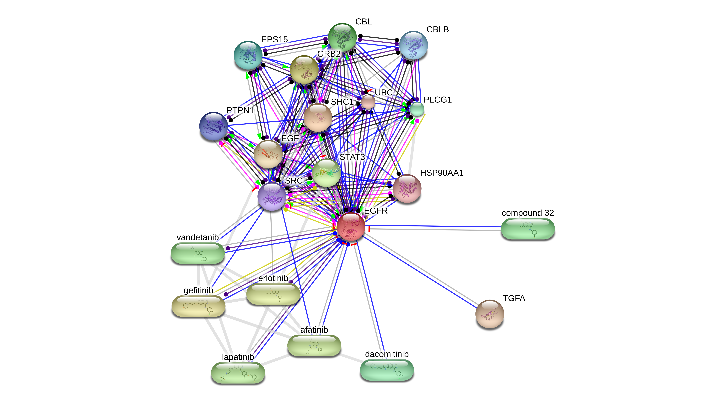

b. ERBB2 (HER2)

Description: Investigates potential inhibitors for ERBB2, often overexpressed or mutated in some NSCLC cases.

```url
http://stitch.embl.de/api/tsv/interactors?identifiers=ERBB2&species=9606&required_score=900&limit=20&chemicalmode=10.5&minprotchem=1
```

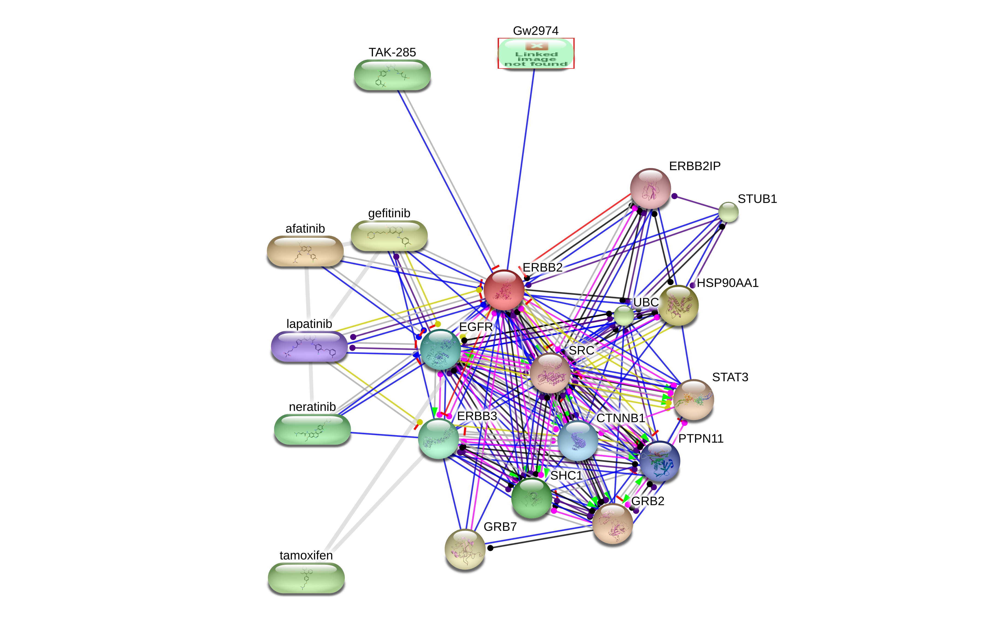

c. KRAS

Description: Examines chemical interactions with KRAS, a frequently mutated gene in NSCLC that has been challenging to target directly.

```url
http://stitch.embl.de/api/tsv/interactors?identifiers=KRAS&species=9606&required_score=900&limit=20&chemicalmode=10.5&minprotchem=1
```

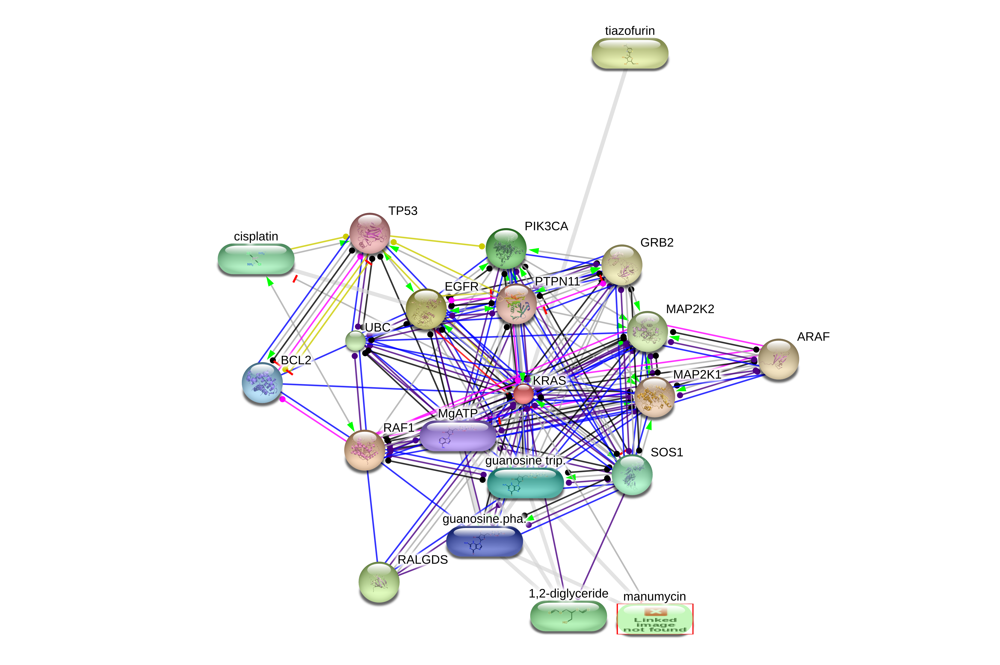

d. EML4-ALK Fusion

Description: Explores potential inhibitors for the EML4-ALK fusion protein, a key driver in a subset of NSCLC cases.

```url
http://stitch.embl.de/api/tsv/interactors?identifiers=EML4%0aALK&species=9606&required_score=900&limit=20&chemicalmode=10.5&minprotchem=1
```

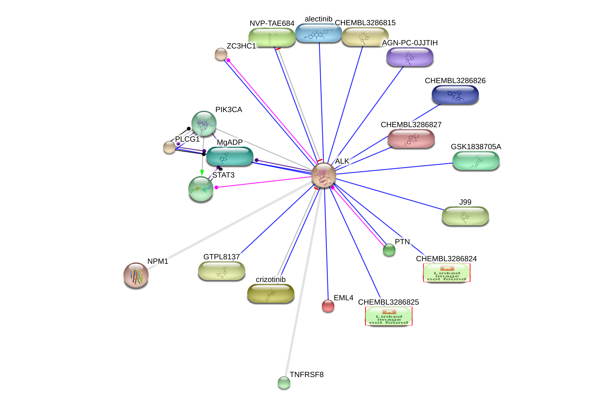

#### 2. Inactivating Mutations

a. TP53

Description: Investigates chemical interactions with TP53, aiming to identify compounds that might restore or bypass its tumor suppressor function.

```url
http://stitch.embl.de/api/tsv/interactors?identifiers=TP53&species=9606&required_score=900&limit=20&chemicalmode=10.5&minprotchem=1
```

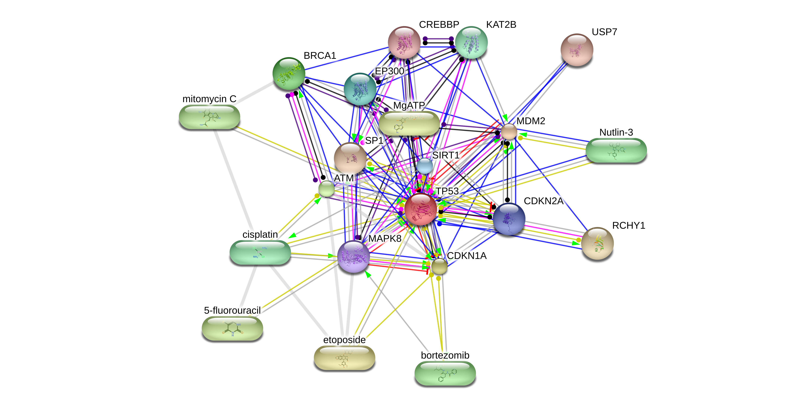

b. CDKN2A

Description: Explores potential ways to compensate for loss of CDKN2A function in cell cycle regulation.

```url
http://stitch.embl.de/api/tsv/interactors?identifiers=CDKN2A&species=9606&required_score=900&limit=20&chemicalmode=10.5&minprotchem=1
```

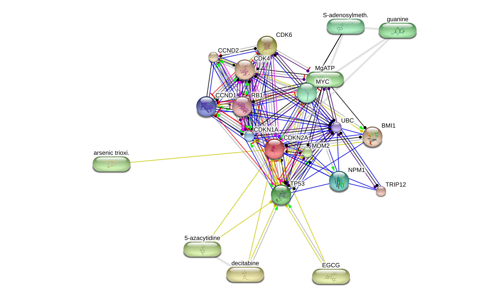

c. RASSF1

Description: Examines chemical interactions with RASSF1, a tumor suppressor often silenced in NSCLC.

```url
http://stitch.embl.de/api/tsv/interactors?identifiers=RASSF1&species=9606&required_score=900&limit=20&chemicalmode=10.5&minprotchem=1
```

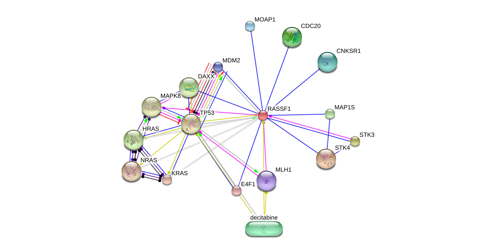

d. FHIT

Description: Investigates compounds interacting with FHIT, a tumor suppressor frequently inactivated in lung cancer.

```url
http://stitch.embl.de/api/tsv/interactors?identifiers=FHIT&species=9606&required_score=900&limit=20&chemicalmode=10.5&minprotchem=1
```

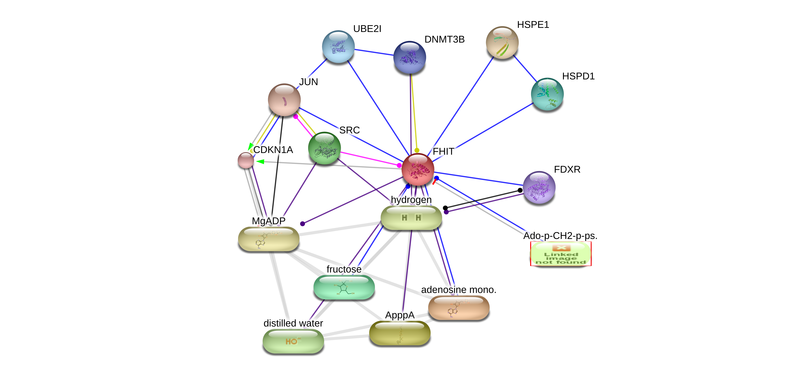

e. RARB

Description: Explores chemical interactions with RARB, aiming to identify compounds that might restore its function in cell growth control.

```url
http://stitch.embl.de/api/tsv/interactors?identifiers=RARB&species=9606&required_score=900&limit=20&chemicalmode=10.5&minprotchem=1
```

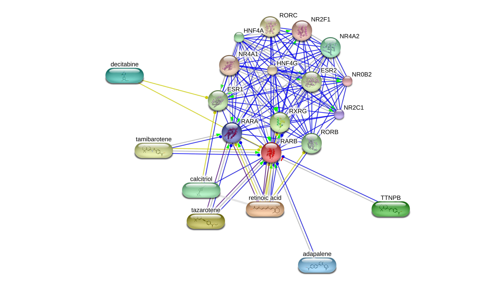

### Upstream & Downstream Regulation

These STITCH queries focus on upstream and downstream regulation, including targets for specific inhibitors in NSCLC pathways.

1. MEK inhibitors:

Description: Examines chemical interactions with MEK1/2, key components of the MAPK pathway often targeted in NSCLC therapy.

```url
http://stitch.embl.de/api/tsv/interactors?identifiers=MAP2K1%0aMAP2K2&species=9606&required_score=900&limit=20&chemicalmode=10.5&minprotchem=1
```

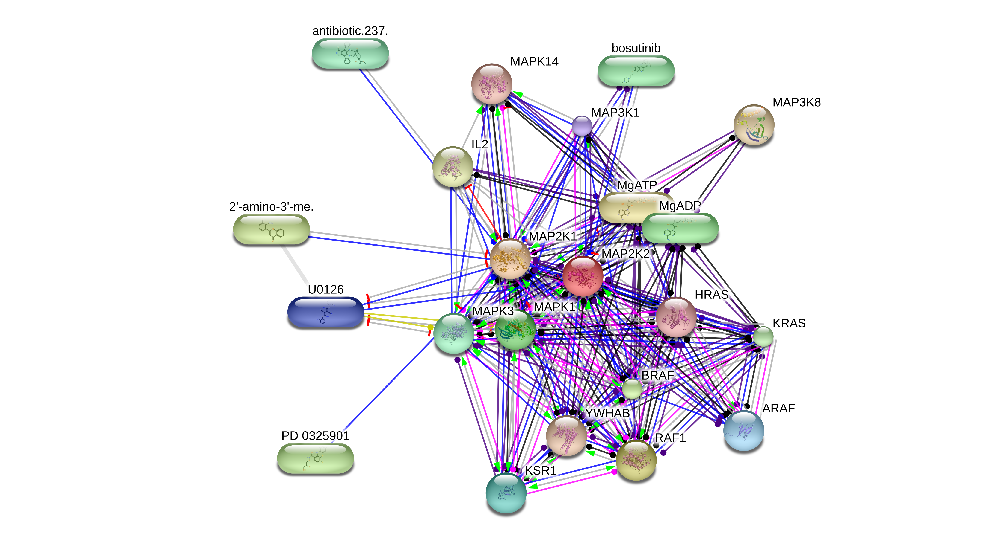

2. BRAF inhibitors:

Description: Investigates potential inhibitors for BRAF and MAP3K11, important in the MAPK signaling cascade.

```url
http://stitch.embl.de/api/tsv/interactors?identifiers=BRAF%0aMAP3K11&species=9606&required_score=900&limit=20&chemicalmode=10.5&minprotchem=1
```

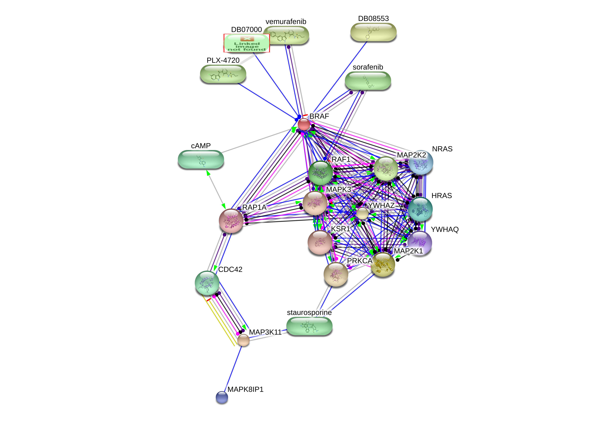

3. PI3K inhibitors:

Description: Explores chemical interactions with various PI3K subunits, crucial components of the PI3K/AKT/mTOR pathway in NSCLC.

```url
http://stitch.embl.de/api/tsv/interactors?identifiers=PIK3CA%0aPIK3CB%0aPIK3CD%0aPIK3R1%0aPIK3R2%0aPIK3R3&species=9606&required_score=900&limit=20&chemicalmode=10.5&minprotchem=1
```

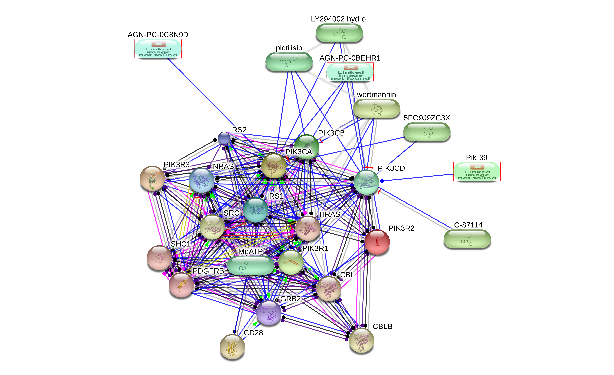

4. CDK4/6 inhibitors:

Description: Examines potential inhibitors for CDK4/6, key regulators of the cell cycle often targeted in cancer therapy.

```url
http://stitch.embl.de/api/tsv/interactors?identifiers=CDK4%0aCDK6&species=9606&required_score=900&limit=20&chemicalmode=10.5&minprotchem=1
```

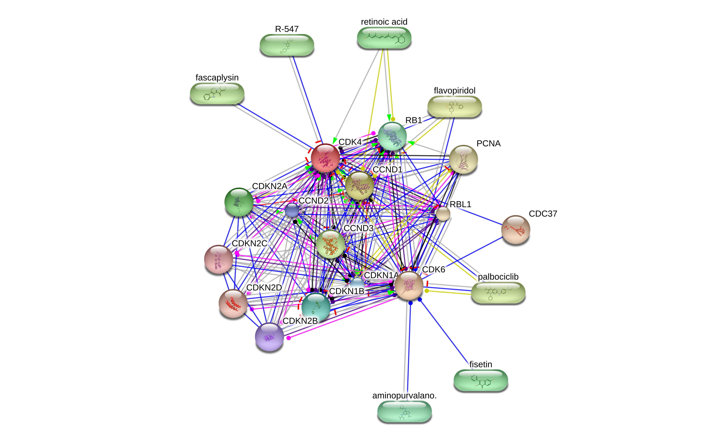

5. p53 pathway downstream effectors:

Description: Investigates chemical interactions with p53 downstream targets, exploring potential ways to modulate p53 pathway activity.

```url
http://stitch.embl.de/api/tsv/interactors?identifiers=CDKN1A%0aBAX%0aBAK1%0aGADD45A%0aGADD45B%0aGADD45G%0aDDB2%0aPOLK&species=9606&required_score=900&limit=20&chemicalmode=10.5&minprotchem=1
```

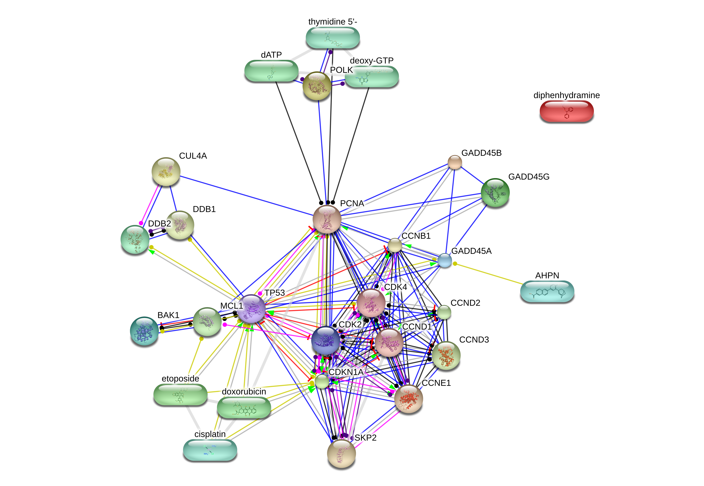

### Notes

For protein-protein interactions, you can create corresponding STRING queries:

```url
https://string-db.org/cgi/network?identifiers=[GENE]&species=9606&required_score=900&network_flavor=evidence&add_white_nodes=10
```

Replace [GENE] with the individual gene or gene list from each STITCH query.

### Summary

These queries focus on genes with activating or inactivating mutations in the NSCLC WikiPathway, as well as key regulatory pathways. They will help identify:

1. For activating mutations: Potential inhibitors or drugs that could counteract the overactive proteins.
2. For inactivating mutations: Possible ways to restore function, compensate for lost function, or exploit synthetic lethality.
3. For upstream and downstream regulators: Potential intervention points and drug interactions for specific targets or pathways.

This approach provides valuable insights into potential therapeutic strategies for NSCLC, targeting both mutated proteins and their regulatory networks as represented in the WikiPathway.

## Conclusion

This comprehensive analysis of signaling pathways in NSCLC provides a foundation for understanding the molecular basis of this disease. By integrating information on pathways, mutations, metabolites, and gene products, we offer insights into potential therapeutic strategies. Future research should focus on:

1. Elucidating the mechanisms of cross-talk between pathways
2. Developing combination therapies targeting multiple pathways
3. Investigating the role of less-studied components, such as the Retinoic Acid pathway
4. Exploring the potential of metabolic interventions in NSCLC treatment

These efforts may lead to more effective targeted therapies and improved outcomes for NSCLC patients.

## Appendix

### Supporting Research

- [KEGG NSCLC Signaling Pathways](nsclc-signaling-pathways-kegg.md)
- [Synthetic Lethality and Combination Therapies in TP53-Deficient Lung Cancer](nsclc-synthetic-lethality-depmap-v2.md)
- [Using Prompt Engineering for ideation on Synthetic Lethality](prompt_engineering\nsclc-synthetic-lethality-paper.md)
- [BioGrid Research meets String MCL clustering](synthetic-lethality-biogrid-analysis.md)

### Table 1: Frequent Mutations in Non-Small Cell Lung Cancer (NSCLC)

| Gene      | Mutation Type              | Frequency | Effect                                           | Consequence                                            |
|-----------|----------------------------|-----------|--------------------------------------------------|--------------------------------------------------------|
| KRAS      | Activating                 | ~29%      | Constitutive activation of RAS signaling         | Continuous transmission of growth signals              |
| EGFR      | Activating/Overexpression  | ~22%      | Increased EGFR signaling                         | Enhanced cell proliferation                            |
| TP53      | Inactivating               | ~50%      | Loss of p53 tumor suppressor function            | Reduced apoptosis and increased proliferation          |
| CDKN2A    | Inactivating               | ~12%      | Loss of CDK4/6 inhibition                        | Dysregulation of cell cycle control                    |
| EML4-ALK  | Fusion                     | ~5%       | Constitutive ALK activation                      | Increased proliferation, invasion, inhibition of apoptosis |
| RARB      | Inactivating               | N/S*      | Loss of retinoic acid receptor function          | Loss of cell growth control                            |

*N/S: Not specified in the provided data

### Table 2: Key Signaling Pathways in Non-Small Cell Lung Cancer (NSCLC)

| Pathway                     | Primary Function                           | Key Components                        | Activation Mechanism            | Main Effects                               |
|-----------------------------|--------------------------------------------|-----------------------------------------|----------------------------------|-------------------------------------------|
| PI3K-Akt Signaling Pathway  | Cell survival and anti-apoptosis           | PI3K, AKT, BAD, CASP9, FOXO3            | Growth factor receptors (e.g., EGFR, ALK) | Inhibition of apoptosis                   |
| Ras Signaling Pathway       | Cell proliferation regulation              | RAS, RAF, MEK, ERK                      | Mutations in KRAS, HRAS, NRAS   | Increased cell division                    |
| Calcium Signaling Pathway   | Cell proliferation                         | PLCγ, IP3, DAG, Ca2+, PKC               | PLCγ activation                 | Promotion of cell growth                   |
| p53 Signaling Pathway       | Cell cycle regulation and apoptosis        | TP53, CDKN1A, BAX, GADD45               | DNA damage                      | Cell cycle arrest, apoptosis (when functional) |
| Cell Cycle Pathway          | Regulation of cell division                | CDKs, cyclins, CDKN2A (p16INK4a)        | Various cellular signals        | Control of cell proliferation              |
| Retinoic Acid Pathway       | Regulation of cell growth and differentiation | RARB, retinoic acid                    | Retinoic acid binding           | Control of cell growth (when functional)   |

### Table 3: Key Gene Products in Non-Small Cell Lung Cancer (NSCLC) Pathways

| Category                | Gene Products                                                                    |
|-------------------------|----------------------------------------------------------------------------------|
| Growth Factors          | EGF, TGFA                                                                        |
| Receptors               | EGFR, ERBB2, ALK                                                                 |
| Kinases                 | PIK3CA, PIK3CB, PIK3CD, PIK3R1, PIK3R2, PIK3R3, AKT1, AKT2, AKT3, PDK1, JAK3, PRKCA, PRKCB, PRKCG, RAF1, ARAF, BRAF, MAP2K1, MAP2K2, MAPK1, MAPK3 |
| GTPases                 | KRAS, HRAS, NRAS                                                                 |
| Tumor Suppressors       | TP53, CDKN1A, CDKN2A, RB1, FHIT, RASSF1, RASSF5                                  |
| Apoptosis Regulators    | BAD, CASP3, CASP8, CASP9, BID, BAK1, BAX, CYCS, FOXO3                            |
| Transcription Factors   | STAT3, STAT5A, STAT5B, E2F1, E2F2, E2F3, RARB                                    |
| Cell Cycle Regulators   | CCND1, CDK4, CDK6                                                                |
| Signaling Adaptors      | GRB2, SOS1, SOS2, PLCG1, PLCG2                                                   |
| DNA Damage Response     | DDB2, GADD45A, GADD45B, GADD45G, POLK                                            |
| Retinoic Acid Pathway   | CRABP1, CRABP2, RXRA, RXRB, RXRG                                                 |

### Table 4: Key Metabolites in Non-Small Cell Lung Cancer (NSCLC) Pathways

| Category              | Metabolites                                                                   |
|-----------------------|-------------------------------------------------------------------------------|
| Secondary Messengers  | DAG (Diacylglycerol), IP3 (Inositol 1,4,5-trisphosphate), Ca2+ (Calcium ions) |
| Signaling Molecules   | Retinoic acid                                                                 |
| Therapeutic Compounds | omacetaxine mepesuccinate, binimetinib, trametinib, pimasertib, selumetinib, cobimetinib |


### Table 5: Therapeutic Approaches in Non-Small Cell Lung Cancer (NSCLC)

| Therapy Type      | Target                         | Examples                                               |
|-------------------|--------------------------------|--------------------------------------------------------|
| EGFR Inhibitors   | EGFR mutations                 | Not specified             |
| ALK Inhibitors    | EML4-ALK fusion                | Not specified             |
| MEK Inhibitors    | Ras signaling pathway          | selumetinib, cobimetinib, trametinib, binimetinib, pimasertib       |
| Retinoic Acid     | Restore RARB function          | Retinoic acid                                          |
| Other Compounds   | Various (targets not specified) | omacetaxine mepesuccinate                  |

Note: Specific mechanisms and indications for some therapies were not provided in the NSCLC WikiPathway documentation.

## Citations

[WikiPathways Non-small cell lung cancer - WP4255](https://www.wikipathways.org/instance/WP4255)

```txt
@article{10.1093/nar/gkad960,
    author = {Agrawal, Ayushi and Balcı, Hasan and Hanspers, Kristina and Coort, Susan L and Martens, Marvin and Slenter, Denise N and Ehrhart, Friederike and Digles, Daniela and Waagmeester, Andra and Wassink, Isabel and Abbassi-Daloii, Tooba and Lopes, Elisson N and Iyer, Aishwarya and Acosta, Javier Millán and Willighagen, Lars G and Nishida, Kozo and Riutta, Anders and Basaric, Helena and Evelo, Chris T and Willighagen, Egon L and Kutmon, Martina and Pico, Alexander R},
    title = "{WikiPathways 2024: next generation pathway database}",
    journal = {Nucleic Acids Research},
    volume = {52},
    number = {D1},
    pages = {D679-D689},
    year = {2023},
    month = {11},
    abstract = "{WikiPathways (wikipathways.org) is an open-source biological pathway database. Collaboration and open science are pivotal to the success of WikiPathways. Here we highlight the continuing efforts supporting WikiPathways, content growth and collaboration among pathway researchers. As an evolving database, there is a growing need for WikiPathways to address and overcome technical challenges. In this direction, WikiPathways has undergone major restructuring, enabling a renewed approach for sharing and curating pathway knowledge, thus providing stability for the future of community pathway curation. The website has been redesigned to improve and enhance user experience. This next generation of WikiPathways continues to support existing features while improving maintainability of the database and facilitating community input by providing new functionality and leveraging automation.}",
    issn = {0305-1048},
    doi = {10.1093/nar/gkad960},
    url = {https://doi.org/10.1093/nar/gkad960},
    eprint = {https://academic.oup.com/nar/article-pdf/52/D1/D679/55040703/gkad960.pdf},
}
```

[The STRING database in 2023: protein–protein association networks and functional enrichment analyses for any sequenced genome of interest](https://academic.oup.com/nar/article/51/D1/D638/6825349)

- use for STITCH content as well

```txt
@article{10.1093/nar/gkac1000,
    author = {Szklarczyk, Damian and Kirsch, Rebecca and Koutrouli, Mikaela and Nastou, Katerina and Mehryary, Farrokh and Hachilif, Radja and Gable, Annika L and Fang, Tao and Doncheva, Nadezhda T and Pyysalo, Sampo and Bork, Peer and Jensen, Lars J and von Mering, Christian},
    title = "{The STRING database in 2023: protein–protein association networks and functional enrichment analyses for any sequenced genome of interest}",
    journal = {Nucleic Acids Research},
    volume = {51},
    number = {D1},
    pages = {D638-D646},
    year = {2022},
    month = {11},
    abstract = "{Much of the complexity within cells arises from functional and regulatory interactions among proteins. The core of these interactions is increasingly known, but novel interactions continue to be discovered, and the information remains scattered across different database resources, experimental modalities and levels of mechanistic detail. The STRING database (https://string-db.org/) systematically collects and integrates protein–protein interactions—both physical interactions as well as functional associations. The data originate from a number of sources: automated text mining of the scientific literature, computational interaction predictions from co-expression, conserved genomic context, databases of interaction experiments and known complexes/pathways from curated sources. All of these interactions are critically assessed, scored, and subsequently automatically transferred to less well-studied organisms using hierarchical orthology information. The data can be accessed via the website, but also programmatically and via bulk downloads. The most recent developments in STRING (version 12.0) are: (i) it is now possible to create, browse and analyze a full interaction network for any novel genome of interest, by submitting its complement of encoded proteins, (ii) the co-expression channel now uses variational auto-encoders to predict interactions, and it covers two new sources, single-cell RNA-seq and experimental proteomics data and (iii) the confidence in each experimentally derived interaction is now estimated based on the detection method used, and communicated to the user in the web-interface. Furthermore, STRING continues to enhance its facilities for functional enrichment analysis, which are now fully available also for user-submitted genomes.}",
    issn = {0305-1048},
    doi = {10.1093/nar/gkac1000},
    url = {https://doi.org/10.1093/nar/gkac1000},
    eprint = {https://academic.oup.com/nar/article-pdf/51/D1/D638/48440966/gkac1000.pdf},
}

```

[Data, information, knowledge and principle: back to metabolism in KEGG](https://academic.oup.com/nar/article/42/D1/D199/1047899)

```txt
@article{10.1093/nar/gkt1076,
    author = {Kanehisa, Minoru and Goto, Susumu and Sato, Yoko and Kawashima, Masayuki and Furumichi, Miho and Tanabe, Mao},
    title = "{Data, information, knowledge and principle: back to metabolism in KEGG}",
    journal = {Nucleic Acids Research},
    volume = {42},
    number = {D1},
    pages = {D199-D205},
    year = {2013},
    month = {11},
    abstract = "{In the hierarchy of data, information and knowledge, computational methods play a major role in the initial processing of data to extract information, but they alone become less effective to compile knowledge from information. The Kyoto Encyclopedia of Genes and Genomes (KEGG) resource (http://www.kegg.jp/ or http://www.genome.jp/kegg/) has been developed as a reference knowledge base to assist this latter process. In particular, the KEGG pathway maps are widely used for biological interpretation of genome sequences and other high-throughput data. The link from genomes to pathways is made through the KEGG Orthology system, a collection of manually defined ortholog groups identified by K numbers. To better automate this interpretation process the KEGG modules defined by Boolean expressions of K numbers have been expanded and improved. Once genes in a genome are annotated with K numbers, the KEGG modules can be computationally evaluated revealing metabolic capacities and other phenotypic features. The reaction modules, which represent chemical units of reactions, have been used to analyze design principles of metabolic networks and also to improve the definition of K numbers and associated annotations. For translational bioinformatics, the KEGG MEDICUS resource has been developed by integrating drug labels (package inserts) used in society.}",
    issn = {0305-1048},
    doi = {10.1093/nar/gkt1076},
    url = {https://doi.org/10.1093/nar/gkt1076},
    eprint = {https://academic.oup.com/nar/article-pdf/42/D1/D199/3561927/gkt1076.pdf},
}
```

[BioGRID: a general repository for interaction datasets](https://academic.oup.com/nar/article/34/suppl_1/D535/1133554)

```txt
@article{10.1093/nar/gkj109,
    author = {Stark, Chris and Breitkreutz, Bobby-Joe and Reguly, Teresa and Boucher, Lorrie and Breitkreutz, Ashton and Tyers, Mike},
    title = "{BioGRID: a general repository for interaction datasets}",
    journal = {Nucleic Acids Research},
    volume = {34},
    number = {suppl_1},
    pages = {D535-D539},
    year = {2006},
    month = {01},
    abstract = "{Access to unified datasets of protein and genetic interactions is critical for interrogation of gene/protein function and analysis of global network properties. BioGRID is a freely accessible database of physical and genetic interactions available at http://www.thebiogrid.org. BioGRID release version 2.0 includes \&gt;116 000 interactions from Saccharomyces cerevisiae, Caenorhabditis elegans, Drosophila melanogaster and Homo sapiens. Over 30 000 interactions have recently been added from 5778 sources through exhaustive curation of the Saccharomyces cerevisiae primary literature. An internally hyper-linked web interface allows for rapid search and retrieval of interaction data. Full or user-defined datasets are freely downloadable as tab-delimited text files and PSI-MI XML. Pre-computed graphical layouts of interactions are available in a variety of file formats. User-customized graphs with embedded protein, gene and interaction attributes can be constructed with a visualization system called Osprey that is dynamically linked to the BioGRID.}",
    issn = {0305-1048},
    doi = {10.1093/nar/gkj109},
    url = {https://doi.org/10.1093/nar/gkj109},
    eprint = {https://academic.oup.com/nar/article-pdf/34/suppl\_1/D535/3925435/gkj109.pdf},
}
```
