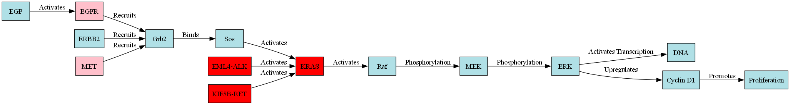
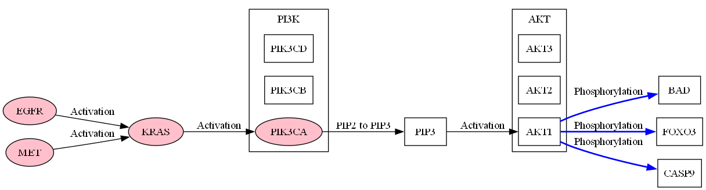

# NSCLC Signaling Pathways

This document provides an overview of key signaling pathways involved in Non-Small Cell Lung Cancer (NSCLC). The information and pathway diagrams are based on the KEGG Non-Small Cell Lung Cancer pathway. You can view the full KEGG pathway diagram [here](nsclc_kegg.png).

Each section includes a brief description of the pathway's role, a link to view the DOT code for generating the diagram, and the resulting image.

## 1. ERK Signaling Pathway

The ERK (Extracellular signal-Regulated Kinases) pathway is a critical signaling cascade in NSCLC. It's often dysregulated due to mutations in EGFR, KRAS, or the presence of oncogenic fusion proteins like EML4-ALK. This pathway plays a crucial role in cell proliferation and survival.

[View ERK Signaling Pathway DOT code](digraph/erk_signaling.dot)

## 2. PI3K Signaling Pathway

The PI3K (Phosphatidylinositol 3-Kinase) pathway is another crucial signaling cascade in NSCLC. It's often activated by receptor tyrosine kinases or RAS proteins and promotes cell survival and growth. Dysregulation of this pathway can lead to increased cell survival and resistance to apoptosis.

[View PI3K Signaling Pathway DOT code](digraph/pI3k_signaling.dot)

## 3. Calcium Signaling Pathway

The Calcium signaling pathway plays a significant role in cell proliferation and is interconnected with other important signaling cascades in NSCLC. It can be activated by growth factor receptors and contributes to the activation of proteins involved in cell cycle progression.

[View Calcium Signaling Pathway DOT code](digraph/calcium_signaling.dot)

## 4. Cell Cycle Pathway

The Cell Cycle pathway is often dysregulated in NSCLC, leading to uncontrolled cell division. Key components of this pathway, such as CDK4/6 and Cyclin D, are frequently altered in lung cancer, resulting in continuous cell cycle progression.

[View Cell Cycle Pathway DOT code](digraph/cell_cycle.dot)

## 5. JAK-STAT Signaling Pathway

The JAK-STAT pathway is involved in cell survival and proliferation in NSCLC, often activated by oncogenic drivers like EML4-ALK. This pathway contributes to cancer cell survival and may play a role in resistance to certain targeted therapies.

[View JAK-STAT Signaling Pathway DOT code](digraph/jak_stat_signaling.dot)

## 6. Other RAS Signaling Pathways

RAS signaling extends beyond the ERK pathway and includes interactions with tumor suppressors like RASSF1. These additional RAS-mediated pathways can influence apoptosis and cell cycle progression, contributing to the complex signaling network in NSCLC.

[View Other RAS Signaling Pathways DOT code](digraph/other_ras_signaling.dot)

## 7. Transcription Regulation

Transcriptional regulation, particularly through p53, plays a crucial role in NSCLC development and progression. p53 is a key tumor suppressor that regulates genes involved in cell cycle arrest, DNA repair, and apoptosis. Its dysfunction can lead to genomic instability and uncontrolled cell growth.

[View Transcription Regulation DOT code](digraph/transcription.dot)

These signaling pathways and their interactions form a complex network that drives NSCLC pathogenesis. Understanding these pathways is crucial for developing targeted therapies and overcoming drug resistance in NSCLC treatment.

For a comprehensive overview of all these pathways and their interactions, refer to the original KEGG Non-Small Cell Lung Cancer pathway diagram linked at the beginning of this document.
