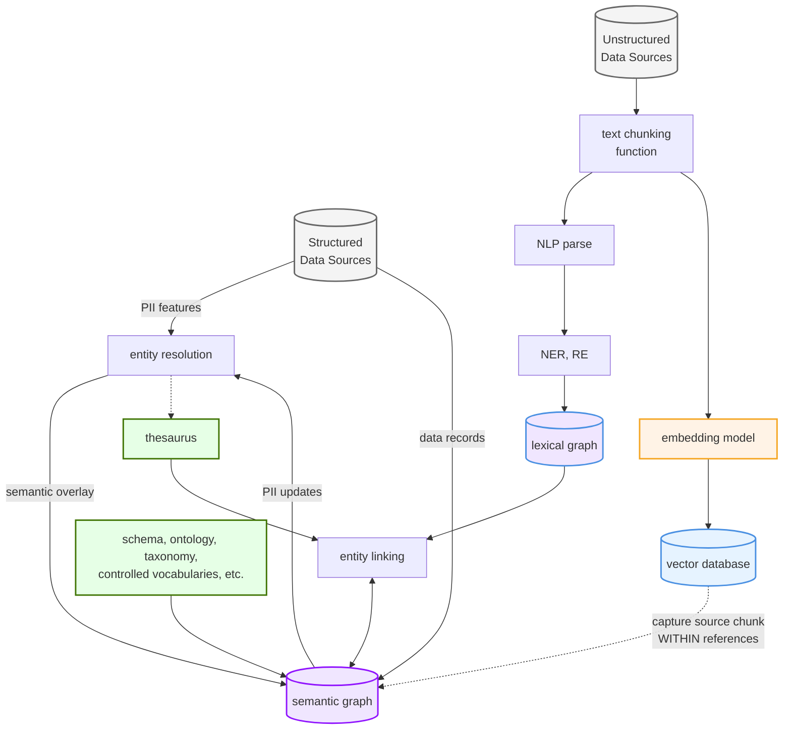
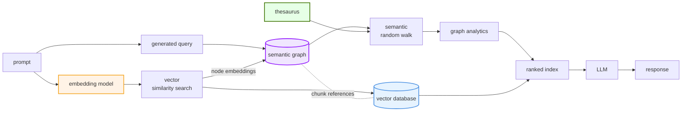
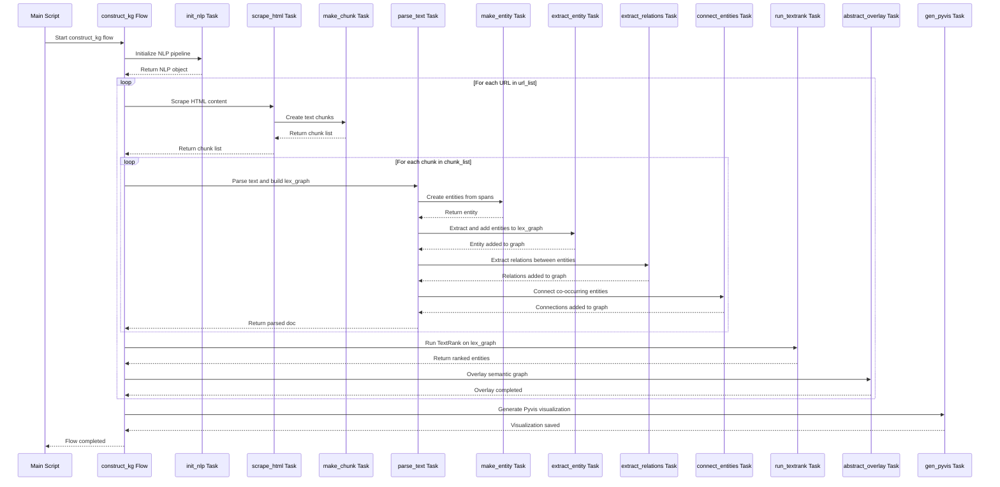
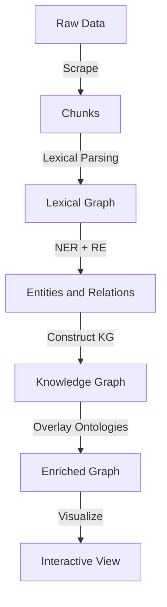

# Knowledge Graph Construction

## Some fundamental concepts

### Data Ingestion

NOTE:  mermaid.js diagrams below are based on some inspiring content from the [Connected Data London 2024: Entity Resolved Knowledge Graphs](https://github.com/DerwenAI/cdl2024_masterclass/blob/main/README.md) masterclass.



### Augment LLM Inference



## Sequence Diagram - capturing the `kg_construction.py` functions and interactions

- I used [Prefect](https://www.prefect.io/) to `dig in` and reverse architect the flow...
  - [graphrag_demo.py](../kg_rememberall/kg_construction.py) is my simple update to [Paco's original python code](./demo.py)
  - I stuck to using Prefect function decorators based on the existing structure, but I'm looking forward to abstracting some of the concepts out further and thinking agentically.
- Telemetry and instrumentation can often demystify complex processes, without the headaches of wading through long print statements.  Some great insight often occurs when you can see how individual functions / components are interacting.
  - this repo features a large and distinguished cast of open source models (GLiNER, GLiREL), open source embeddings (BGE, Word2Vec) and a vector store (LanceDB) for improved entity recognition and relationship extraction.
- For a deeper dive, [Paco Nathan's YouTube video and associated diagrams](https://senzing.com/gph-graph-rag-llm-knowledge-graphs/) help highlight real-world use cases where effective Knowledge Graph construction can provide deeper meaning and insight.




## Run the code

1. setup local Python environment and install Python dependencies

  - I used Python 3.11, but 3.10 should work as well

  ```bash
  pip install -r requirements.txt
  ```

2. Start the local Prefect server

  - follow the [self-hosted instructions](https://docs.prefect.io/v3/get-started/quickstart#connect-to-a-prefect-api) to launch the `Prefect UI`

  ```python
  prefect server start
  ```

3. run the `../kg_rememberall/kg_construction.py` script

  - from a new terminal session navigate to the kg_rememberall directory

  ```python
  python kg_construction.py
  ```

## Appendix: Code Overview and Purpose

- The code forms part of a talk for **GraphGeeks.org** about constructing **knowledge graphs** from **unstructured data sources**, such as web content.
- It integrates web scraping, natural language processing (NLP), graph construction, and interactive visualization.

---

### **Key Components and Flow**

#### **1. Model and Parameter Settings**
- **Core Configuration**: Establishes the foundational settings like chunk size, embedding models (`BAAI/bge-small-en-v1.5`), and database URIs.
- **NER Labels**: Defines entity categories such as `Person`, `Organization`, `Publication`, and `Technology`.
- **Relation Types**: Configures relationships like `works_at`, `developed_by`, and `authored_by` for connecting entities.
- **Scraping Parameters**: Sets user-agent headers for web requests.

#### **2. Data Validation**
- **Classes**:
  - `TextChunk`: Represents segmented text chunks with their embeddings.
  - `Entity`: Tracks extracted entities, their attributes, and relationships.
- **Purpose**: Ensures data is clean and well-structured for downstream processing.

#### **3. Data Collection**
- **Functions**:
  - `scrape_html`: Fetches and parses webpage content.
  - `uni_scrubber`: Cleans Unicode and formatting issues.
  - `make_chunk`: Segments long text into manageable chunks for embedding.
- **Role**: Prepares raw, unstructured data for structured analysis.

#### **4. Lexical Graph Construction**
- **Initialization**:
  - `init_nlp`: Sets up NLP pipelines with spaCy, GLiNER (NER), and GLiREL (RE).
- **Graph Parsing**:
  - `parse_text`: Creates lexical graphs using TextRank algorithms.
  - `make_entity`: Extracts and integrates entities into the graph.
  - `connect_entities`: Links entities co-occurring in the same context.
- **Purpose**: Converts text into a structured, connected graph of entities and relationships.

#### **5. Numerical Processing**
- **Functions**:
  - `calc_quantile_bins`: Creates quantile bins for numerical data.
  - `root_mean_square`: Computes RMS for normalization.
  - `stripe_column`: Applies quantile binning to data columns.
- **Role**: Provides statistical operations to refine and rank graph components.

#### **6. TextRank Implementation**
- **Functions**:
  - `run_textrank`: Ranks entities in the graph based on a PageRank-inspired algorithm.
- **Purpose**: Identifies and prioritizes key entities for knowledge graph construction.

#### **7. Semantic Overlay**
- **Functions**:
  - `abstract_overlay`: Abstracts a semantic layer from the lexical graph.
  - Connects entities to their originating text chunks for context preservation.
- **Role**: Enhances the graph with higher-order relationships and semantic depth.

#### **8. Visualization**
- **Tool**: `pyvis`
- **Functions**:
  - `gen_pyvis`: Creates an interactive visualization of the knowledge graph.
- **Features**:
  - Node sizing reflects entity importance.
  - Physics-based layout supports intuitive exploration.

#### **9. Orchestration**
- **Function**:
  - `construct_kg`: Orchestrates the full pipeline from data collection to visualization.
- **Purpose**: Ensures the seamless integration of all layers and components.

---

### **Notable Implementation Details**

- **Multi-Layer Graph Representation**: Combines lexical and semantic graphs for layered analysis.
- **Vector Embedding Integration**: Enhances entity representation with embeddings.
- **Error Handling and Debugging**: Includes robust logging and debugging features.
- **Scalability**: Designed for handling diverse and large datasets with dynamic relationships.

---

## Appendix:  Architectural Workflow

### **1. Architectural Workflow: A Layered Approach to Knowledge Graph Construction**

#### **1.1 Workflow Layers**

**Data Ingestion:**
- Role: Extract raw data from structured and unstructured sources for downstream processing.
- Responsibilities: Handle diverse data formats, ensure quality, and standardize for analysis.
- Requirements: Reliable scraping, parsing, and chunking mechanisms to prepare data for embedding and analysis.

**Lexical Graph Construction:**
- Role: Build a foundational graph by integrating tokenized data and semantic relationships.
- Responsibilities: Identify key entities through tokenization and ranking (e.g., TextRank).
- Requirements: Efficient methods for integrating named entities and relationships into a coherent graph structure.

**Entity and Relation Extraction:**
- Role: Identify and label entities, along with their relationships, to enrich the graph structure.
- Responsibilities: Extract domain-specific entities (NER) and relationships (RE) to add connectivity.
- Requirements: Domain-tuned models and algorithms for accurate extraction.

**Graph Construction and Visualization:**
- Role: Develop and display the knowledge graph to facilitate analysis and decision-making.
- Responsibilities: Create a graph structure using tools like NetworkX and enable exploration with interactive visualizations (e.g., PyVis).
- Requirements: Scalable graph-building frameworks and intuitive visualization tools.

**Semantic Overlay:**
- Role: Enhance the graph with additional context and reasoning capabilities.
- Responsibilities: Integrate ontologies, taxonomies, and domain-specific knowledge to provide depth and precision.
- Requirements: Mechanisms to map structured data into graph elements and ensure consistency with existing knowledge bases.


### **2. Visualized Workflow**

#### **2.1 Logical Data Flow**



---

### **3. Glossary**

| **Participant**                | **Description**                                                                                   | **Workflow Layer**                 |
|--------------------------------|---------------------------------------------------------------------------------------------------|-------------------------------------|
| **HTML Scraper (BeautifulSoup)** | Fetches unstructured text data from web sources.                                                  | Data Ingestion                     |
| **Text Chunker**               | Breaks raw text into manageable chunks (e.g., 1024 tokens) and prepares them for embedding.        | Data Ingestion                     |
| **SpaCy Pipeline**             | Processes chunks and integrates GLiNER and GLiREL for entity and relation extraction.             | Entity and Relation Extraction     |
| **Embedding Model (bge-small-en-v1.5)** | Captures lower-level lexical meanings of text and translates them into machine-readable vector representations. | Data Ingestion |
| **GLiNER**                     | Identifies domain-specific entities and returns labeled outputs.                                  | Entity and Relation Extraction     |
| **GLiREL**                     | Extracts relationships between identified entities, adding connectivity to the graph.             | Entity and Relation Extraction     |
| **Vector Database (LanceDB)**  | Stores chunk embeddings for efficient querying in downstream tasks.                              | Data Ingestion         |
| **Word2Vec (Gensim)**          | Generates entity embeddings based on graph co-occurrence for additional analysis.                 | Semantic Graph Construction         |
| **Graph Constructor (NetworkX)** | Builds and analyzes the knowledge graph, ranking entities using TextRank.                       | Graph Construction and Visualization |
| **Graph Visualizer (PyVis)**   | Provides an interactive visualization of the knowledge graph for interpretability.                | Graph Construction and Visualization |

## Citations: giving credit where credit is due...

Inspired by the great work done by multiple individuals who created the [Connected Data London 2024: Entity Resolved Knowledge Graphs](https://github.com/donbr/cdl2024_masterclass/blob/main/README.md) masterclass I created this document to highlight areas that rang true.

- Paco Nathan https://senzing.com/consult-entity-resolution-paco/
- Clair Sullivan https://clairsullivan.com/
- Louis Guitton https://guitton.co/
- Jeff Butcher https://github.com/jbutcher21
- Michael Dockter https://github.com/docktermj

The code to use GLiNER and GLiREL started as a fork of one of four repos that make up the masterclass.