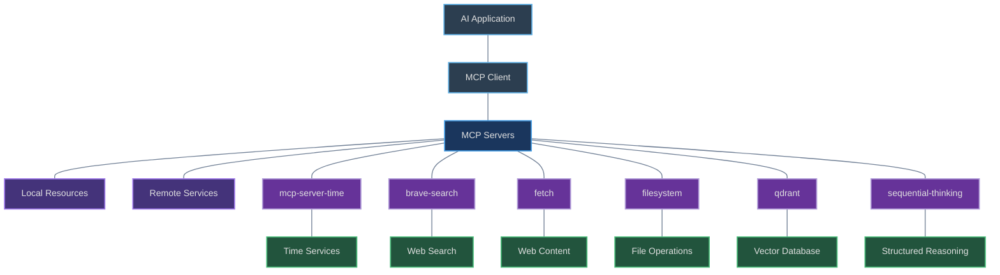

# Model Context Protocol (MCP) Servers: Technical Reference Guide

## Introduction to Model Context Protocol

The Model Context Protocol (MCP) is an open standard developed by Anthropic that standardizes how AI applications can connect to external tools and data sources. MCP serves as a "USB-C port for AI applications," providing a uniform method for AI systems to interact with various tools and data sources . This protocol addresses the inherent limitations of standalone AI models by creating pathways to access real-time data, perform actions in external systems, and leverage specialized tools beyond their built-in capabilities .

## MCP Architecture Overview



The MCP architecture consists of several key components working together:

1. **MCP Hosts**: AI applications (like Claude Desktop or AI-driven IDEs) that need external data access
2. **MCP Clients**: Components that maintain one-to-one connections with MCP servers
3. **MCP Servers**: Lightweight programs exposing specific capabilities through standardized interfaces
4. **Local Data Sources**: Files, databases, or services on the local machine
5. **Remote Services**: External systems available over the internet

## MCP Server Implementation Details

### 1. MCP Server Time

**Purpose:** A Model Context Protocol server that provides time and timezone conversion capabilities. This server enables AI models to get current time information and perform timezone conversions using IANA timezone names, with automatic system timezone detection.

**Features:**
- Get current time in specific timezones
- Convert times between different timezones
- Automatic system timezone detection

**Installation Process:**
```bash
# Configuration from provided JSON
"mcp-server-time": {
  "command": "uvx",
  "args": [
    "mcp-server-time",
    "--local-timezone=America/Los_Angeles"
  ],
  "env": {}
}
```

The server can be installed and run using several methods:

1. Using uvx directly: `uvx mcp-server-time`
2. With a specific timezone: `uvx mcp-server-time --local-timezone=America/New_York`
3. Using pip: `pip install mcp-server-time`

**Use Cases:**
- Getting current time in specific timezones
- Converting between different timezone formats
- Schedule management for international teams
- Time-aware applications that need timezone intelligence

### 2. Brave Search

**Purpose:** An MCP server implementation that integrates the Brave Search API, providing both web and local search capabilities with smart fallbacks and flexible filtering options.

**Features:**
- Web Search Capability: General web searches with advanced features like pagination and content freshness
- Local Search Integration: Searches for businesses and services within the user's vicinity
- Advanced filtering options to control result types and safety levels

**Installation Process:**
```bash
# Configuration from provided JSON
"brave-search": {
  "command": "npx",
  "args": [
    "-y",
    "@modelcontextprotocol/server-brave-search"
  ],
  "env": {
    "BRAVE_API_KEY": "MASKED"
  }
}
```

Setup process:
1. Sign up for a Brave Search API account and generate an API key
2. Install using NPX: `npx -y @modelcontextprotocol/server-brave-search`
3. Configure with your API key as an environment variable

**Use Cases:**
- General Information Retrieval: Retrieving up-to-date information on a wide array of topics
- Local Business Discovery: Finding nearby services and businesses 
- Research: Academic or professional research requiring current information

### 3. Fetch MCP Server

**Purpose:** A server that flexibly fetches HTML, JSON, Markdown, or plaintext from web sources, designed for efficient LLM usage. This MCP server provides functionality to fetch web content in various formats.

**Features:**
- Fetches web content in various formats (HTML, JSON, plain text, Markdown)
- Designed to fetch and transform web content on demand
- No persistent resources required

**Installation Process:**
```bash
# Configuration from provided JSON
"fetch": {
  "command": "uvx",
  "args": [
    "mcp-server-fetch"
  ]
}
```

The server can be installed and run using:
1. Using uvx: `uvx mcp-server-fetch`
2. Through NPM packages
3. Docker installation is also available for containerized deployment

**Use Cases:**
- Retrieving content from specific URLs
- Extracting information from web pages
- Converting web content to formats easily consumable by AI models
- Accessing and analyzing online documentation

### 4. Filesystem Server

**Purpose:** Secure file operations with configurable access controls. This server provides tools for reading, writing, and managing files with appropriate security boundaries.

**Features:**
- Reading and writing files
- Directory operations (listing, creation)
- File search capabilities
- Security controls for file access

**Installation Process:**
```bash
# Configuration from provided JSON
"filesystem": {
  "command": "npx",
  "args": [
    "-y",
    "@modelcontextprotocol/server-filesystem",
    "\\\\wsl.localhost\\Ubuntu\\home\\MASKED\\aim"
  ],
  "env": {}
}
```

The server can be installed using NPX:
```bash
npx -y @modelcontextprotocol/server-filesystem PATH_TO_DIRECTORY
```
Where PATH_TO_DIRECTORY specifies which directory to expose to the AI.

**Use Cases:**
- Reading and writing files
- Managing project files and structures
- Accessing documentation or knowledge bases
- Creating and modifying configuration files

### 5. Qdrant Server

**Purpose:** Implement semantic memory layer on top of the Qdrant vector search engine. This MCP server connects to Qdrant vector database for semantic search and AI memory storage.

**Features:**
- Vector database operations
- Semantic search capabilities
- Memory storage for AI applications
- Embedding generation and management

**Installation Process:**
```bash
# Configuration from provided JSON
"qdrant": {
  "command": "uvx",
  "args": [
    "mcp-server-qdrant"
  ],
  "env": {
    "QDRANT_URL": "MASKED.us-east4-0.gcp.cloud.qdrant.io:6333",
    "QDRANT_API_KEY": "MASKED",
    "COLLECTION_NAME": "PICK-NAME-BASED-ON-USE-CASE",
    "EMBEDDING_MODEL": "sentence-transformers/all-MiniLM-L6-v2"
  }
}
```

**Configuration Requirements:**
- QDRANT_URL: URL of your Qdrant instance
- QDRANT_API_KEY: API key for authentication
- COLLECTION_NAME: Name of the collection to use
- EMBEDDING_MODEL: Model used for generating embeddings

**Use Cases:**
- Building semantic search capabilities
- Implementing AI memory systems
- Knowledge retrieval based on meaning rather than keywords
- Creating persistent memory for chatbots and AI assistants

### 6. Sequential Thinking Server

**Purpose:** An MCP server implementation that provides a tool for dynamic and reflective problem-solving through a structured thinking process. Enhances AI problem-solving capabilities through structured reasoning.

**Features:**
- Step-by-step reasoning processes
- Problem decomposition
- Structured thinking frameworks
- Hypothesis generation and testing

**Installation Process:**
```bash
# Configuration from provided JSON
"sequential-thinking": {
  "command": "cmd",
  "args": [
    "/c",
    "npx",
    "-y",
    "@modelcontextprotocol/server-sequential-thinking"
  ]
}
```

**Use Cases:**
- Complex problem-solving requiring step-by-step reasoning
- Breaking down complex tasks into manageable steps
- Debugging code with systematic analysis
- Planning and design processes

## Integration with Cursor AI

Cursor AI is a powerful code editor enhanced with AI capabilities, and Model Context Protocol (MCP) extends its functionality by connecting it to external tools and data sources. The configuration you've provided allows Cursor AI to interact with six different MCP servers for enhanced functionality.

**Integration Steps:**

1. **Configuration Setup:**
   - Create or modify `.cursor/settings.json` with your MCP server configuration
   - Follow the structure provided in your JSON snippet for each server
   - Ensure all required environment variables are correctly set

2. **Server Startup:**
   - Start each required MCP server in separate terminal sessions
   - Verify connections are established before proceeding

3. **Cursor AI Restart:**
   - Restart Cursor AI to load the new configuration
   - Test connections by asking Cursor AI to perform tasks using the MCP servers

## Security Considerations

The Model Context Protocol enables powerful capabilities through arbitrary data access and code execution paths. With this power comes important security considerations:

1. Tools represent arbitrary code execution and must be treated with appropriate caution
2. Users should understand what each tool does before authorizing its use
3. Implement appropriate access controls and data protections

## Resource Links

- [Cursor Documentation on MCP](https://docs.cursor.com/context/model-context-protocol)
- [Introduction to Model Context Protocol](https://modelcontextprotocol.io)
- [Sample MCP Servers](https://modelcontextprotocol.io/examples)
- [MCP on GitHub](https://github.com/modelcontextprotocol)
- [Cursor Community Forum](https://forum.cursor.com/)
- [Stanford's Co-STORM](https://storm.genie.stanford.edu/) - a great free resource with similar capabilities that I recommend using in parallel with Claude Desktop and MCP

## Appendix: API Key Setup Guide

This appendix provides detailed, step-by-step instructions for obtaining and configuring API keys for the MCP servers in this configuration that require authentication.

### Brave Search API Key Setup

#### Account Creation and API Key Acquisition

1. **Visit the Brave Search API page**
   - Navigate to [brave.com/search/api/](https://brave.com/search/api/)
   - Click on "Get 2,000 free queries" or "Get started for FREE" [1]

2. **Register for an account**
   - Complete the registration form at [api-dashboard.search.brave.com/register](https://api-dashboard.search.brave.com/register)
   - Registration is subject to the Search API privacy notice and terms of service [2]

3. **Subscribe to a plan**
   - Even for the free tier (which allows 2,000 queries/month and 1 query/second), you need to subscribe but won't be charged [2]
   - Select your desired plan based on usage needs (Data for AI, Data for Search, or Data w/ storage rights) [1]

4. **Generate an API key**
   - Once subscribed, navigate to the "API Keys" section in your dashboard [2]
   - Click on the option to create a new API key [2]
   - Your API key will be displayed - save it securely as it cannot be retrieved later [3]

#### Configuration in MCP Server

1. **Add the API key to your MCP server configuration**
   ```json
   "brave-search": {
     "command": "npx",
     "args": [
       "-y",
       "@modelcontextprotocol/server-brave-search"
     ],
     "env": {
       "BRAVE_API_KEY": "YOUR_API_KEY_HERE"
     }
   }
   ```
   This configuration format is based on the MCP server documentation.

2. **API key usage in direct requests**
   - When making requests directly to the Brave Search API, the API key must be included in the header as `X-Subscription-Token` [2]
   - Example curl request:
   ```
   curl -s --compressed "https://api.search.brave.com/res/v1/web/search?q=search_term" \
   -H "Accept: application/json" \
   -H "Accept-Encoding: gzip" \
   -H "X-Subscription-Token: YOUR_API_KEY_HERE"
   ```
   This example is from the official Brave Search API documentation [2]

### Qdrant API Key Setup

#### Cloud Account and Cluster Creation

1. **Register for a Qdrant Cloud account**
   - Visit [cloud.qdrant.io](https://cloud.qdrant.io/)
   - Sign up with your email, Google, or GitHub credentials [7]

2. **Create your first cluster**
   - After registration, go to the Overview page
   - Follow the onboarding instructions under "Create First Cluster" [7]
   - Configure your cluster settings as needed [7]

3. **Obtain your initial API key**
   - When creating a cluster, you will receive an API key [7]
   - Save this API key securely as it will be needed for authentication and may not be retrievable later [7][6]
   - Your new cluster will be created under the "Clusters" section - wait for it to provision [7]

4. **Access your cluster dashboard**
   - Go to your Clusters section
   - Under "Actions," open the Dashboard [7]
   - Paste your API key when prompted [7]
   - The key will grant you access to your Qdrant instance [7]

#### Creating Additional API Keys (Optional)

1. **Navigate to the API Keys management section**
   - Go to the Cloud Dashboard
   - Go to the API Keys section of the Cluster detail page [6]

2. **Create a new API key**
   - Click the "Create" button [6]
   - Choose a name for your API key [6]
   - Set an optional expiration (in days, the default is 90 days) [6]
   - An empty expiration will result in no expiration [6]

3. **Set permissions (if using granular access control)**
   - By default, tokens are given cluster-wide permissions [6]
   - Choose between manage/write permissions (default) or read-only [6]
   - To restrict a token to a subset of collections, select the Collections tab and choose from available collections [6]

4. **Finalize API key creation**
   - Click "Create" and retrieve your API key [6]
   - Note that the API key is only shown once after creation [6]
   - If you lose it, you will need to create a new one [6]

#### Configuration in MCP Server

1. **Add your Qdrant API key to your MCP server configuration**
   ```json
   "qdrant": {
     "command": "uvx",
     "args": [
       "mcp-server-qdrant"
     ],
     "env": {
       "QDRANT_URL": "YOUR_QDRANT_INSTANCE_URL:6333",
       "QDRANT_API_KEY": "YOUR_API_KEY_HERE",
       "COLLECTION_NAME": "YOUR_COLLECTION_NAME",
       "EMBEDDING_MODEL": "sentence-transformers/all-MiniLM-L6-v2"
     }
   }
   ```
   This configuration is based on the standard Qdrant MCP server format.

2. **API key usage in direct requests**
   - When making direct requests to Qdrant, the API key can be included in the header using either format:
     ```
     --header 'api-key: YOUR_API_KEY_HERE'
     ```
     or
     ```
     --header 'Authorization: Bearer YOUR_API_KEY_HERE'
     ```
   - Example curl request:
     ```
     curl -X GET https://your-instance.qdrant.cloud.io:6333 \
     --header 'api-key: YOUR_API_KEY_HERE'
     ```
   These examples are from the Qdrant Cloud documentation [6][7]

### References

[1] Brave Search API official page: https://brave.com/search/api/

[2] Brave Search API documentation: https://api-dashboard.search.brave.com/app/documentation/web-search/get-started

[3] Brave Search API launch blog: https://brave.com/blog/search-api-launch/

[4] *removed*

[5] Qdrant Cloud homepage: https://cloud.qdrant.io/

[6] Qdrant Cloud Authentication documentation: https://qdrant.tech/documentation/cloud/authentication/

[7] Qdrant Cloud Quickstart guide: https://qdrant.tech/documentation/quickstart-cloud/

[8] Qdrant Security documentation: https://qdrant.tech/documentation/guides/security/

---

*This technical reference guide is current as of April 2025. Server configurations and installation methods may be updated over time.*
