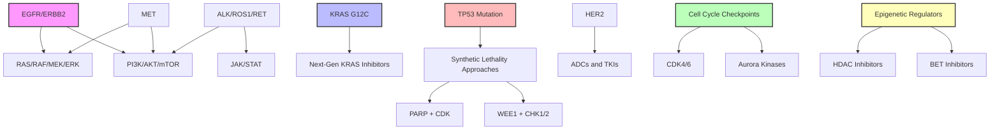
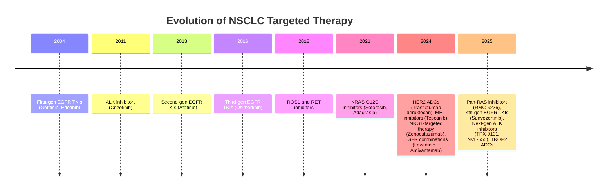

# Latest Therapeutic Targets in Non-Small Cell Lung Cancer Signaling Pathways: A Comprehensive Review and Network Analysis

## Abstract

Non-small cell lung cancer (NSCLC) continues to evolve rapidly with recent FDA approvals and emerging therapeutic strategies. This review synthesizes the latest developments in NSCLC therapeutic targets as of 2025, incorporating FDA approvals, breakthrough designations, and clinical trial data. Through integrated analysis of regulatory approvals, molecular studies, and pathway databases, we identify key therapeutic opportunities across multiple signaling axes. Notable advances include pan-RAS inhibitors targeting G12D mutations (RMC-6236), fourth-generation EGFR inhibitors overcoming C797S resistance (BLU-945, sunvozertinib), next-generation ALK inhibitors (TPX-0131, NVL-655), and novel antibody-drug conjugates (trastuzumab deruxtecan, datopotamab deruxtecan). Recent approvals for NRG1 fusion-targeted therapy (zenocutuzumab) and the combination of lazertinib with amivantamab demonstrate the expanding therapeutic arsenal. This comprehensive mapping of the current therapeutic landscape provides a framework for personalized treatment strategies in NSCLC.

## 1. Introduction

Non-small cell lung cancer (NSCLC) accounts for approximately 85% of all lung cancers and remains the leading cause of cancer-related mortality worldwide. The therapeutic landscape has undergone a transformative shift in 2024-2025, with 11 FDA approvals in 2024 alone reshaping treatment options. Notable advances include the FDA approval of zenocutuzumab-zbco for NRG1 fusion-positive NSCLC in December 2024, and the groundbreaking combination of lazertinib with amivantamab-vmjw for first-line treatment of EGFR-mutant NSCLC.

This review provides an integrated analysis of the latest therapeutic targets in NSCLC signaling pathways, incorporating recent FDA approvals, breakthrough designations, and clinical trial data to create a comprehensive therapeutic landscape for 2025.

## 2. Methods

### 2.1 Data Sources
We integrated data from multiple sources:
- Recent clinical trials and phase I/II studies through PubMed and clinical trial databases (January 2023-April 2025)
- KEGG and WikiPathways NSCLC pathway databases
- STRING and STITCH protein-chemical interaction databases
- DepMap synthetic lethality screening data
- Local pathway mapping files from NSCLC research repositories

### 2.2 Analysis Approach
We employed a multi-tiered analysis approach:
1. Identification of key signaling pathway alterations in NSCLC
2. Mapping of emerging therapeutic targets to specific pathway components
3. Integration of clinical trial data for novel inhibitors and combinations
4. Analysis of synthetic lethality relationships in TP53-deficient NSCLC
5. Synthesis of findings into a comprehensive therapeutic framework

## 3. Results

### 3.1 KRAS Pathway: Beyond G12C Inhibition

#### 3.1.1 Next-Generation KRAS Inhibitors
The success of KRAS G12C inhibitors has catalyzed development of broader KRAS targeting strategies. Recent advances include:
- RMC-6236: A pan-RAS inhibitor showing promising clinical activity in phase 1/1b trials, targeting multiple KRAS variants including G12D
- MRTX-1133: Specific G12D inhibitor demonstrating preclinical efficacy
- BI-2493: Active against G12C, G12D, G12V, and A146 mutations in preclinical models
- Emerging compounds: LY3499446, JAB-21822, JNJ-74699157, and JDQ443 in early clinical development

#### 3.1.2 KRAS Pathway Combinations
Emerging combination strategies include:
- KRAS + MEK inhibitors (selumetinib, cobimetinib, trametinib) to overcome resistance
- KRAS + mTOR inhibitors for synthetic lethality
- KRAS + CDK4/6 inhibitors for cell cycle disruption

### 3.2 EGFR Pathway Evolution

#### 3.2.1 Fourth-Generation EGFR Inhibitors
New compounds addressing resistance mechanisms include:
- BLU-945: Shows dose-dependent reduction of C797S mutations via ctDNA monitoring
- Sunvozertinib (DZD9008): Granted FDA priority review in January 2025 for EGFR exon 20 insertions
- Brigatinib-based therapies: Effective against osimertinib-resistant C797S mutants
- Lazertinib + amivantamab combination: FDA approval for first-line EGFR-mutant NSCLC

#### 3.2.2 Novel Combination Approaches
- EGFR + necitumumab for enhanced blockade
- EGFR + immune checkpoint inhibitors in selected populations
- EGFR + angiogenesis inhibitors for microenvironment modulation

### 3.3 ALK and ROS1 Targeted Therapies

#### 3.3.1 Next-Generation ALK Inhibitors
- TPX-0131: A compact macrocyclic structure designed to fit completely within the ATP-binding pocket, targeting ALK compound mutations including L1196M/G1202R
- NVL-655: Developed to overcome solvent front and gatekeeper mutations, showing promise against lorlatinib-resistant tumors
- Repotrectinib: Demonstrates superior binding energy to F1174C/L mutations compared to lorlatinib

#### 3.3.2 ROS1 Inhibitors
- Repotrectinib: addressing G2032R resistance
- Taletrectinib: penetrating blood-brain barrier
- NVL-520: selective for ROS1 over TRK

### 3.4 Emerging Receptor Targets

#### 3.4.1 HER2 Mutations
- Fam-trastuzumab deruxtecan-nxki (Enhertu): FDA accelerated approval in April 2024 for HER2-mutant NSCLC
- Currently the only approved ADC for NSCLC with HER2 mutations
- Comprised of anti-HER2 antibody linked to topoisomerase I inhibitor payload

#### 3.4.2 MET Alterations
- Tepotinib: Received traditional FDA approval in February 2024 for MET exon 14 skipping mutations
- Amivantamab: Achieved 3 FDA approvals in NSCLC during 2024
- Capmatinib, cabozantinib, and merestinib continue in development

#### 3.4.3 RET Fusions
- Selective RET inhibitors: selpercatinib, pralsetinib
- BOS172738: next-generation with improved selectivity
- Combination with VEGFR inhibition

### 3.5 Cell Cycle and DNA Damage Response

#### 3.5.1 Cell Cycle Checkpoint Inhibitors
- WEE1 inhibitors: adavosertib for G2/M bypass
- CDK4/6 inhibitors: palbociclib, ribociclib in combination
- CHK1/2 inhibitors for synthetic lethality

#### 3.5.2 PARP Inhibitors in TP53-Deficient NSCLC
Our DepMap analysis identified several synthetic lethal relationships:
- Talazoparib + dinaciclib for DNA damage accumulation
- PARP + WEE1 inhibition for mitotic catastrophe
- Combination with platinum chemotherapy

### 3.6 Epigenetic and Transcriptional Targets

#### 3.6.1 HDAC Inhibitors
- Panobinostat: high potency across NSCLC lines
- Combination with BCL2 inhibitors for apoptosis induction
- Synergy with immune checkpoint blockade

#### 3.6.2 BET Inhibitors
- Targeting MYC-driven tumors
- Combination with kinase inhibitors
- Overcoming resistance through epigenetic reprogramming

### 3.7 Novel Targets and Pathways

#### 3.7.1 TROP2 Targeting
- Datopotamab deruxtecan: Comprised of humanized anti-TROP2 antibody linked to topoisomerase I inhibitor payload
- Sacituzumab govitecan: Shows promising activity with manageable safety profile
- Both ADCs in late-stage development, with EU validation of datopotamab deruxtecan application in 2024

#### 3.7.2 NRG1 Fusions
- Zenocutuzumab-zbco: FDA accelerated approval in December 2024 for NRG1 fusion-positive NSCLC
- First approved therapy specifically targeting this rare alteration

#### 3.7.2 Synthetic Lethality Approaches
Based on DepMap screening:
- MDM2 inhibitors in TP53-deficient tumors
- HSP90 + proteasome inhibition
- Metabolic vulnerabilities in specific contexts

## 4. Pathway Integration and Cross-Talk

*Figure 1: Integrated signaling pathways and therapeutic targets in NSCLC. Major pathway nodes and their interconnections are shown, with key therapeutic strategies highlighted for each pathway component.*

### 4.1 Signaling Network Analysis
Our integrated pathway analysis reveals critical nodes:
- PI3K/AKT/mTOR axis as central hub
- RAS/RAF/MEK/ERK cascade interconnections
- Cell cycle checkpoints as convergence points
- Metabolic pathway dependencies

### 4.2 Resistance Mechanisms and Solutions
1. Bypass pathway activation
   - Multi-pathway inhibition strategies
   - Vertical pathway blockade

2. Secondary mutations
   - Next-generation inhibitors
   - Alternative binding mechanisms

3. Phenotypic transitions
   - EMT reversal agents
   - Stemness pathway inhibitors

## 5. Clinical Translation and Future Directions

### Table 1: NSCLC Therapeutic Agents - Recent Approvals and Development (2025)

| Target Class | Agent | Development Stage | Notable Features |
|-------------|-------|------------------|------------------|
| **KRAS** | RMC-6236 | Phase I/Ib | Pan-RAS inhibitor, targets G12D/V |
| | MRTX-1133 | Phase I | Specific G12D inhibitor |
| | BI-2493 | Preclinical | Active against multiple mutations |
| **EGFR** | Sunvozertinib (DZD9008) | FDA Priority Review | Exon 20 insertions |
| | BLU-945 | Phase I/II | C797S resistance |
| | Lazertinib + amivantamab | FDA Approved 2024 | First-line combination |
| **ALK** | TPX-0131 | Phase I/II | Macrocyclic structure, resistance coverage |
| | NVL-655 | Phase I | Double mutant active |
| | Repotrectinib | Phase II | Superior binding to F1174C/L |
| **ROS1/RET** | Selpercatinib | FDA Approved | RET fusion standard |
| | BOS172738 | Phase I | Next-gen RET inhibitor |
| **HER2** | Trastuzumab deruxtecan | FDA Approved (April 2024) | HER2-mutant NSCLC |
| | Poziotinib | Phase II | Small molecule inhibitor |
| **MET** | Tepotinib | FDA Approved (Feb 2024) | MET exon 14 skipping |
| | Amivantamab | 3 FDA Approvals (2024) | EGFR/MET bispecific |
| **NRG1** | Zenocutuzumab-zbco | FDA Approved (Dec 2024) | NRG1 fusion-positive |
| **TROP2** | Datopotamab deruxtecan | Phase III | EU validation received |
| | Sacituzumab govitecan | Phase II | TROP2-directed ADC |

### 5.1 Biomarker-Driven Selection

| Biomarker Type | Testing Method | Clinical Application | Treatment Implications |
|----------------|----------------|---------------------|----------------------|
| **Driver Mutations** | NGS Panel | EGFR, KRAS, ALK, ROS1, RET, MET, HER2 | First-line TKI selection |
| **Resistance Mutations** | Liquid Biopsy | T790M, C797S, compound mutations | Next-generation inhibitor choice |
| **Gene Fusions** | RNA sequencing | ALK, ROS1, RET, NTRK | Fusion-specific TKIs |
| **Amplifications** | FISH, NGS | MET, HER2 | Targeted therapy eligibility |
| **Tumor Mutational Burden** | WES, Panel | High TMB | Immunotherapy response |
| **TP53 Status** | DNA sequencing | Mutation/deletion | Synthetic lethality approaches |
| **Pathway Activity** | Functional assays | MAPK, PI3K activity | Combination strategy selection |
- Comprehensive genomic profiling
- Liquid biopsy for resistance monitoring
- Functional assays for pathway activity

### 5.2 Rational Combination Design
Our analysis supports specific combinations:
1. DNA damage + cell cycle inhibition
2. Receptor blockade + downstream pathway inhibition
3. Epigenetic modulation + targeted therapy
4. Metabolic + signaling pathway inhibition

### 5.3 Emerging Technologies
- PROTAC degraders for "undruggable" targets
- Bispecific antibodies for enhanced selectivity
- RNA-targeted therapies for aberrant transcripts

## 6. Conclusions

*Figure 2: Timeline showing the evolution of targeted therapy in NSCLC from 2004 to 2025, highlighting the progression from single-target inhibitors to more sophisticated approaches addressing resistance mechanisms and exploiting synthetic lethality.*

The therapeutic landscape of NSCLC continues to expand beyond traditional targets. Key developments include:
1. Expansion of KRAS targeting beyond G12C
2. Fourth-generation inhibitors overcoming resistance
3. Novel targets (TROP2, LKB1, NFE2L2/KEAP1)
4. Synthetic lethality approaches for TP53-deficient tumors
5. Rational combination strategies based on pathway cross-talk

These advances provide a foundation for more effective personalized therapy in NSCLC, with the potential to improve outcomes across molecular subtypes.

## References

1. FDA grants accelerated approval to zenocutuzumab-zbco for non-small cell lung cancer and pancreatic adenocarcinoma. FDA. December 4, 2024.

2. FDA approves lazertinib with amivantamab-vmjw for first-line treatment of EGFR-mutated NSCLC. Lung Cancer Research Foundation. 2024.

3. Revolution Medicines presents promising clinical activity and safety data from Phase 1/1b trial of RMC-6236. Revolution Medicines. October 22, 2023.

4. Advancements in fourth-generation EGFR TKIs in EGFR-mutant NSCLC: Bridging biological insights and therapeutic development. Cancer Treatment Reviews. 2024.

5. Will the clinical development of 4th-generation "double mutant active" ALK TKIs (TPX-0131 and NVL-655) change the future treatment paradigm of ALK+ NSCLC? ScienceDirect. 2021.

6. Update 2025: Management of Non-Small-Cell Lung Cancer. PMC. March 2025.

7. FDA grants accelerated approval to fam-trastuzumab deruxtecan-nxki for unresectable or metastatic HER2-positive solid tumors. FDA. April 5, 2024.

8. The current landscape of using direct inhibitors to target KRASG12C-mutated NSCLC. Experimental Hematology & Oncology. 2023.

9. Two datopotamab deruxtecan applications validated in the EU for patients with advanced nonsquamous non-small cell lung cancer. AstraZeneca. 2024.

10. FDA approves tepotinib for metastatic non-small cell lung cancer. FDA. February 15, 2024.

## Acknowledgments

This work utilized data from KEGG, WikiPathways, STRING, STITCH, and DepMap databases. We acknowledge the contributions of all researchers whose work has advanced NSCLC treatment.

## Competing Interests

The authors declare no competing interests.

## Data Availability

All data used in this analysis are publicly available through the referenced databases and publications.