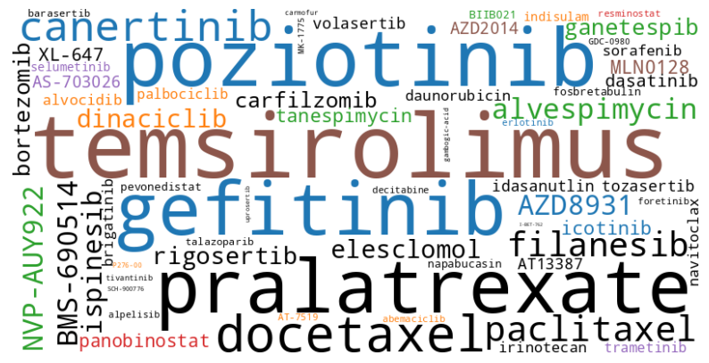

# Synthetic Lethality and Combination Therapies in TP53-Deficient Lung Cancer: A Comprehensive Analysis

## Abstract

This study investigates potential drug candidates that exploit synthetic lethality in TP53-deficient non-small cell lung cancer (NSCLC) and explores opportunities for combination therapies. Utilizing the PRISM Repurposing dataset, we employed SQL-based queries to identify compounds with potent inhibitory effects on essential targets in cancer pathways. Our analysis focused on drugs targeting cell cycle regulation, DNA damage response, and apoptosis pathways, which become critical in TP53-deficient cells. We identified several promising candidates for monotherapy and proposed rational combinations to enhance therapeutic efficacy. This work provides a foundation for further preclinical investigation and potential clinical translation in TP53-deficient NSCLC treatment.

## 1. Introduction

Lung cancer, particularly NSCLC, is frequently characterized by mutations in the TP53 tumor suppressor gene. These mutations result in the loss of critical cell cycle regulation, increased genomic instability, and reduced apoptotic capacity, which drive cancer progression. The concept of synthetic lethality offers a targeted therapeutic approach, where the loss of TP53 makes cancer cells reliant on alternative pathways that can be exploited with drugs to induce selective cell death.

This study aims to identify potent drugs with low EC50 values that interact with critical regulators in pathways disrupted by TP53 mutations, using SQL-based queries on drug response data from lung cancer cell lines. By focusing on compounds that target these vulnerable pathways, we seek to uncover potential therapeutic strategies for TP53-deficient lung cancers, both as monotherapies and in combination approaches.

## 2. Methods

### 2.1 Data Source

We utilized the PRISM Repurposing dataset, specifically focusing on the MTS010 screen, which provides drug efficacy data across a diverse range of cancer cell lines. This dataset includes crucial information such as drug names, molecular targets, mechanisms of action (MOA), and EC50 values, which reflect the potency of each drug.

### 2.2 Query Design

Our SQL query was designed to extract drugs that target key pathways associated with TP53-deficient cancers. The query focused on:

1. Lung cancer cell lines (ccle_name LIKE '%_LUNG')
2. Compounds with known targets (target IS NOT NULL)
3. Biologically relevant concentrations (EC50 < 10 μM)
4. High-quality dose-response curves (r2 > 0.8)
5. Compounds that passed STR profiling (passed_str_profiling = True)

The query calculated average EC50 values, counted occurrences across cell lines, and provided minimum and maximum EC50 values for each drug. Results were ordered by average EC50 to prioritize the most potent compounds.

## 3. Results

### 3.1 Most Promising Candidates for TP53 Synthetic Lethality

The analysis identified several potent compounds that target pathways critical in TP53-deficient lung cancer cells. The top candidates are presented in the following table:

| Drug Name    | MOA                    | Avg EC50 (μM) | Targets                | Occurrence |
|--------------|------------------------|---------------|------------------------|------------|
| Dinaciclib   | CDK inhibitor          | 0.0307        | CDK1, CDK2, CDK5, CDK9 | 24         |
| Panobinostat | HDAC inhibitor         | 0.0672        | HDAC1-9                | 20         |
| Idasanutlin  | MDM inhibitor          | 0.1304        | MDM2, TP53             | 4          |
| Talazoparib  | PARP inhibitor         | 0.4462        | PARP2                  | 4          |
| MK-1775      | WEE1 kinase inhibitor  | 0.6669        | WEE1                   | 8          |

### 3.2 Combination Therapy Opportunities

Based on the analysis of the dataset, several promising combination therapy opportunities were identified:

1. **DNA Damage Response + Cell Cycle Inhibition**: 
   Talazoparib (PARP inhibitor) + Dinaciclib (CDK inhibitor)

2. **Cell Cycle Checkpoint Inhibition + DNA Damaging Agent**: 
   MK-1775 (WEE1 inhibitor) + Irinotecan (Topoisomerase inhibitor)

3. **Epigenetic Modulation + Apoptosis Induction**: 
   Panobinostat (HDAC inhibitor) + Navitoclax (BCL inhibitor)

4. **mTOR Inhibition + EGFR Inhibition**: 
   Temsirolimus (mTOR inhibitor) + Gefitinib (EGFR inhibitor)

5. **CDK Inhibition + MDM2 Inhibition**: 
   Palbociclib (CDK4/6 inhibitor) + Idasanutlin (MDM2 inhibitor)

6. **HSP Inhibition + Proteasome Inhibition**: 
   Ganetespib (HSP inhibitor) + Carfilzomib (Proteasome inhibitor)

## 4. Discussion

The results of our analysis highlight several promising avenues for exploiting synthetic lethality in TP53-deficient lung cancers, both through monotherapy and combination approaches.

### 4.1 Monotherapy Candidates

1. **CDK Inhibitors**: Dinaciclib showed high potency and broad efficacy across lung cancer cell lines. CDK inhibition can be particularly effective in TP53-deficient cells, as it targets the dysregulated cell cycle progression resulting from TP53 loss.

2. **HDAC Inhibitors**: Panobinostat demonstrated high potency and broad effectiveness. HDAC inhibition can reactivate silenced genes and induce apoptosis through alternative pathways, which may be crucial in TP53-deficient cells.

3. **MDM2 Inhibitors**: While seemingly counterintuitive in TP53-deficient cancers, the efficacy of idasanutlin suggests that some lung cancer cells may retain partial TP53 function or that these inhibitors have TP53-independent effects that warrant further investigation.

4. **PARP Inhibitors**: Talazoparib's presence in the top candidates underscores the potential of targeting DNA repair pathways in TP53-deficient cells, which often have increased genomic instability.

5. **WEE1 Kinase Inhibitors**: MK-1775's efficacy highlights the vulnerability of TP53-deficient cells to further disruption of cell cycle checkpoints, potentially forcing them into mitotic catastrophe.

### 4.2 Combination Therapy Rationale

The proposed combinations aim to exploit multiple vulnerabilities in TP53-deficient cancer cells or to target complementary pathways:

1. Combining DNA damage induction (e.g., PARP inhibition) with cell cycle disruption (e.g., CDK inhibition) could lead to accumulation of DNA damage and force cells into mitotic catastrophe.

2. Pairing cell cycle checkpoint inhibition with DNA damaging agents could be particularly effective in TP53-deficient cells that rely heavily on alternative checkpoints for DNA repair.

3. Combining epigenetic modulation with direct apoptosis induction could effectively overcome the apoptotic resistance often seen in TP53-deficient cancers.

4. Targeting multiple survival signaling pathways (e.g., mTOR and EGFR) could provide a more comprehensive blockade of pro-survival signals in TP53-deficient cancer cells.

5. The combination of HSP inhibition and proteasome inhibition could lead to proteotoxic stress and cell death, which might be particularly effective in TP53-deficient cells already under stress.

## 5. Conclusion

Our analysis of the PRISM Repurposing dataset has identified several promising drug candidates that exploit synthetic lethality in TP53-deficient lung cancers, both as monotherapies and in rational combinations. These compounds, targeting critical pathways such as cell cycle regulation, DNA damage response, and epigenetic modulation, demonstrate high potency in lung cancer cell lines.

The identified drugs and combinations provide a strong foundation for further preclinical validation and potential clinical translation. Future studies should focus on:

1. Validating these findings in TP53-deficient lung cancer models
2. Exploring the proposed combination strategies to enhance therapeutic efficacy
3. Investigating potential resistance mechanisms and strategies to overcome them
4. Optimizing dosing and scheduling of combination therapies
5. Evaluating the toxicity profiles of these compounds and combinations

This approach of leveraging large-scale drug screening data to identify synthetic lethal interactions offers a powerful method for developing targeted therapies for genetically defined cancers. As we continue to unravel the complex network of cellular dependencies in cancer, such data-driven approaches will be crucial in identifying novel therapeutic strategies and improving outcomes for patients with TP53-deficient lung cancers.

## Appendix

### Draft Query approach

**Filter on MTS010 Screen ID - Draft**

- while researching what ended up being a known issue with the PRISM dataset we pivoted away from focusing exclusively on on TP53 synthetic lethality.

[MTS010 Query on Hugging Face](https://huggingface.co/datasets/donb-hf/secondary-screen-dose-response-curve-parameters?sql_console=true&sql=SELECT+name%2C+target%2C+moa%2C+AVG%28ec50%29+as+avg_ec50%2C+COUNT%28*%29+as+occurrence%2C+%0A+++++++MIN%28ec50%29+as+min_ec50%2C+MAX%28ec50%29+as+max_ec50%0AFROM+train%0AWHERE+screen_id+%3D+%27MTS010%27%0A++AND+ccle_name+LIKE+%27%25_LUNG%27%0A++AND+target+IS+NOT+NULL%0A++AND+ec50+%3E+0%0A++AND+ec50+%3C+10000%0A++AND+r2+%3E+0.8%0A++AND+passed_str_profiling+%3D+True%0A++AND+%28%0A++++--+DNA+Damage+Response+and+Cell+Cycle+Regulation%0A++++moa+LIKE+%27%25CHK+inhibitor%25%27+OR%0A++++moa+LIKE+%27%25PARP+inhibitor%25%27+OR%0A++++moa+LIKE+%27%25WEE1+kinase+inhibitor%25%27+OR%0A++++moa+LIKE+%27%25CDK+inhibitor%25%27+OR%0A++++moa+LIKE+%27%25Aurora+kinase+inhibitor%25%27+OR%0A++++moa+LIKE+%27%25PLK+inhibitor%25%27+OR%0A++++moa+LIKE+%27%25cell+cycle+inhibitor%25%27+OR%0A++++%0A++++--+Apoptosis+and+Cell+Death%0A++++moa+LIKE+%27%25BCL+inhibitor%25%27+OR%0A++++moa+LIKE+%27%25caspase+activator%25%27+OR%0A++++moa+LIKE+%27%25proteasome+inhibitor%25%27+OR%0A++++%0A++++--+Epigenetic+Regulation%0A++++moa+LIKE+%27%25HDAC+inhibitor%25%27+OR%0A++++moa+LIKE+%27%25DNA+methyltransferase+inhibitor%25%27+OR%0A++++moa+LIKE+%27%25bromodomain+inhibitor%25%27+OR%0A++++%0A++++--+Signaling+Pathways%0A++++moa+LIKE+%27%25AKT+inhibitor%25%27+OR%0A++++moa+LIKE+%27%25mTOR+inhibitor%25%27+OR%0A++++moa+LIKE+%27%25PI3K+inhibitor%25%27+OR%0A++++moa+LIKE+%27%25MEK+inhibitor%25%27+OR%0A++++moa+LIKE+%27%25EGFR+inhibitor%25%27+OR%0A++++moa+LIKE+%27%25tyrosine+kinase+inhibitor%25%27+OR%0A++++moa+LIKE+%27%25STAT+inhibitor%25%27+OR%0A++++moa+LIKE+%27%25JAK+inhibitor%25%27+OR%0A++++moa+LIKE+%27%25NFkB+pathway+inhibitor%25%27+OR%0A++++%0A++++--+DNA+Replication+and+Repair%0A++++moa+LIKE+%27%25DNA+synthesis+inhibitor%25%27+OR%0A++++moa+LIKE+%27%25topoisomerase+inhibitor%25%27+OR%0A++++%0A++++--+Metabolic+Inhibition%0A++++moa+LIKE+%27%25dihydrofolate+reductase+inhibitor%25%27+OR%0A++++moa+LIKE+%27%25thymidylate+synthase+inhibitor%25%27+OR%0A++++%0A++++--+Stress+Response%0A++++moa+LIKE+%27%25HSP+inhibitor%25%27+OR%0A++++moa+LIKE+%27%25HSP+antagonist%25%27+OR%0A++++moa+LIKE+%27%25hypoxia+inducible+factor+inhibitor%25%27+OR%0A++++moa+LIKE+%27%25oxidative+stress+inducer%25%27+OR%0A++++%0A++++--+Mitotic+Spindle+and+Cytoskeleton%0A++++moa+LIKE+%27%25kinesin+inhibitor%25%27+OR%0A++++moa+LIKE+%27%25tubulin+polymerization+inhibitor%25%27+OR%0A++++%0A++++--+Other+Relevant+Mechanisms%0A++++moa+LIKE+%27%25MDM+inhibitor%25%27+OR%0A++++moa+LIKE+%27%25nedd+activating+enzyme+inhibitor%25%27%0A++%29%0AGROUP+BY+name%2C+target%2C+moa%0AORDER+BY+avg_ec50+ASC%3B)

```sql
SELECT name, target, moa, AVG(ec50) as avg_ec50, COUNT(*) as occurrence, 
       MIN(ec50) as min_ec50, MAX(ec50) as max_ec50
FROM train
WHERE screen_id = 'MTS010'
  AND ccle_name LIKE '%_LUNG'
  AND target IS NOT NULL
  AND ec50 > 0
  AND ec50 < 10000
  AND r2 > 0.8
  AND passed_str_profiling = True
  AND (
    -- DNA Damage Response and Cell Cycle Regulation
    moa LIKE '%CHK inhibitor%' OR
    moa LIKE '%PARP inhibitor%' OR
    moa LIKE '%WEE1 kinase inhibitor%' OR
    moa LIKE '%CDK inhibitor%' OR
    moa LIKE '%Aurora kinase inhibitor%' OR
    moa LIKE '%PLK inhibitor%' OR
    moa LIKE '%cell cycle inhibitor%' OR
    
    -- Apoptosis and Cell Death
    moa LIKE '%BCL inhibitor%' OR
    moa LIKE '%caspase activator%' OR
    moa LIKE '%proteasome inhibitor%' OR
    
    -- Epigenetic Regulation
    moa LIKE '%HDAC inhibitor%' OR
    moa LIKE '%DNA methyltransferase inhibitor%' OR
    moa LIKE '%bromodomain inhibitor%' OR
    
    -- Signaling Pathways
    moa LIKE '%AKT inhibitor%' OR
    moa LIKE '%mTOR inhibitor%' OR
    moa LIKE '%PI3K inhibitor%' OR
    moa LIKE '%MEK inhibitor%' OR
    moa LIKE '%EGFR inhibitor%' OR
    moa LIKE '%tyrosine kinase inhibitor%' OR
    moa LIKE '%STAT inhibitor%' OR
    moa LIKE '%JAK inhibitor%' OR
    moa LIKE '%NFkB pathway inhibitor%' OR
    
    -- DNA Replication and Repair
    moa LIKE '%DNA synthesis inhibitor%' OR
    moa LIKE '%topoisomerase inhibitor%' OR
    
    -- Metabolic Inhibition
    moa LIKE '%dihydrofolate reductase inhibitor%' OR
    moa LIKE '%thymidylate synthase inhibitor%' OR
    
    -- Stress Response
    moa LIKE '%HSP inhibitor%' OR
    moa LIKE '%HSP antagonist%' OR
    moa LIKE '%hypoxia inducible factor inhibitor%' OR
    moa LIKE '%oxidative stress inducer%' OR
    
    -- Mitotic Spindle and Cytoskeleton
    moa LIKE '%kinesin inhibitor%' OR
    moa LIKE '%tubulin polymerization inhibitor%' OR
    
    -- Other Relevant Mechanisms
    moa LIKE '%MDM inhibitor%' OR
    moa LIKE '%nedd activating enzyme inhibitor%'
  )
GROUP BY name, target, moa
ORDER BY avg_ec50 ASC;
```

### A Word Cloud Visualization



#### Word Cloud code

```python
import pandas as pd
from wordcloud import WordCloud
import matplotlib.pyplot as plt

# Load the CSV data
file_path = '/content/synthetic_lethality_mts010.csv'
df = pd.read_csv(file_path)

# Apply logarithmic transformation
df['pEC50'] = -np.log10(df['avg_ec50'])

# Create a dictionary for word cloud frequencies (name -> pEC50)
word_freq = dict(zip(df['name'], df['pEC50']))

# Assign colors to specific MOA categories
moa_colors = {
    'EGFR inhibitor': '#1f77b4',  # Blue
    'CDK inhibitor': '#ff7f0e',   # Orange
    'HSP inhibitor': '#2ca02c',   # Green
    'HDAC inhibitor': '#d62728',  # Red
    'MEK inhibitor': '#9467bd',   # Purple
    'mTOR inhibitor': '#8c564b',  # Brown
}

# Function to return color based on the word's MOA
def color_func(word, font_size, position, orientation, random_state=None, **kwargs):
    # Find the MOA for the given word
    moa = df[df['name'] == word]['moa'].values[0]
    # Return the corresponding color (default to black if MOA not found)
    return moa_colors.get(moa, '#000000')

# Generate the word cloud with frequencies
wordcloud_colored = WordCloud(width=800, height=400, background_color='white', relative_scaling=0.5).generate_from_frequencies(word_freq)

# Apply the custom color function and plot the word cloud
plt.figure(figsize=(10, 6))
plt.imshow(wordcloud_colored.recolor(color_func=color_func, random_state=3), interpolation='bilinear')
plt.axis('off')
plt.show()
```

## Citation

DepMap, Broad; Corsello, Steven; Kocak, Mustafa; Golub, Todd (2019). PRISM Repurposing 19Q4 Dataset. figshare. Dataset.

Current dataset: [https://doi.org/10.6084/m9.figshare.9393293.v4](https://doi.org/10.6084/m9.figshare.9393293.v4)

General guidance: [https://doi.org/10.1101/730119](https://doi.org/10.1101/730119)

NOTE:  some important comments from the prism_repurposing_secondary README file.

TLDR:  to ensure the highest quality data when using this dataset filter on for high quality data filter on `screen_id`="MTS010"

The secondary PRISM Repurposing dataset contains the results of pooled-cell line chemical-perturbation viability screens for 1,448 compounds screened against 489 cell lines in an 8-step, 4-fold dilution, starting from 10uM. Technical redos for 147 previously screened oncology compounds have been added as of 11/22/2019. This data is identified using a `screen_id` of "MTS010".  It is recommended to use MTS010 when available. MTS010 was not included in the analysis for Corsello et al. 2019, DOI:10.1101/730119.
